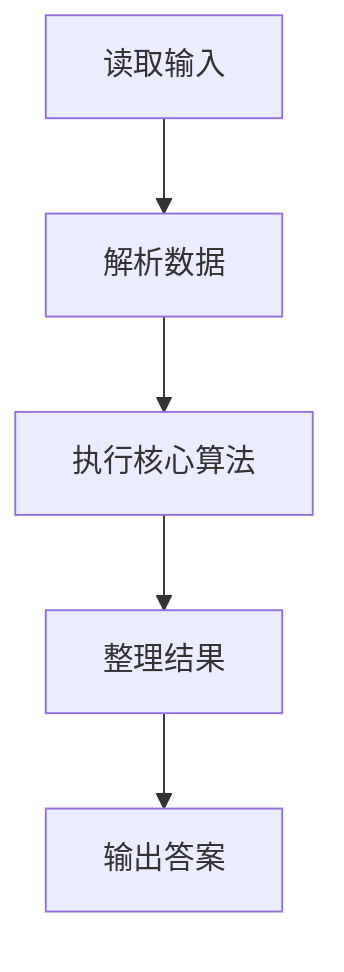
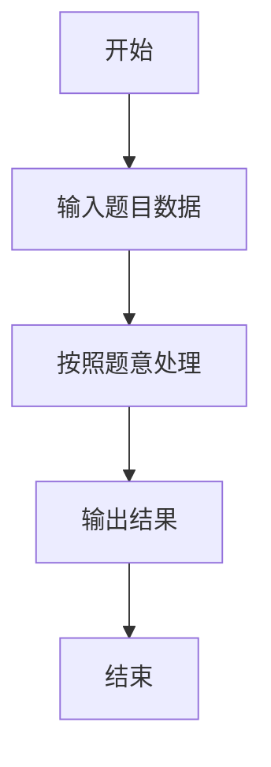

# L1-002 - 打印沙漏（20 分）

- **时间限制**: 400 ms
- **内存限制**: 65536 KB
- **代码长度限制**: 16 KB

---

## 题目描述


本题要求你写个程序把给定的符号打印成沙漏的形状。例如给定17个“*”，要求按下列格式打印
```
*****
 ***
  *
 ***
*****
```

所谓“沙漏形状”，是指每行输出奇数个符号；各行符号中心对齐；相邻两行符号数差2；符号数先从大到小顺序递减到1，再从小到大顺序递增；首尾符号数相等。

给定任意N个符号，不一定能正好组成一个沙漏。要求打印出的沙漏能用掉尽可能多的符号。

### 输入格式:

输入在一行给出1个正整数N（$$\le$$1000）和一个符号，中间以空格分隔。

### 输出格式:

首先打印出由给定符号组成的最大的沙漏形状，最后在一行中输出剩下没用掉的符号数。

### 输入样例:
```in
19 *
```

### 输出样例:
```out
*****
 ***
  *
 ***
*****
2
```

## 示例

### 示例 1

**输入:**
```
19 *
```

**输出:**
```
*****
 ***
  *
 ***
*****
2
```

### 解题思路

本题的 Ruby 实现采用字符串解析与规则处理。程序先读取题目输入，建立与题意对应的数据结构，按照约束完成核心计算，并按规定格式输出结果。具体实现以同目录的 main.rb 为准。

### 代码流程说明

1. 读取并解析标准输入，转换为题目所需的数据结构。
2. 按题意执行核心算法，维护中间状态并处理边界情况。
3. 整理计算结果，按照输出格式生成答案。

### 代码实现

完整实现位于同目录的 [main.rb](./main.rb)，以下代码与该入口文件保持一致。

```ruby
# frozen_string_literal: true
require_relative '../gplt_runtime'
def entry
  data = py_tokens
  if py_truth(data)
    n = py_int(data[0])
    ch = data[1].to_s
    k = 1
    while (((((2 * (k + 1)) * (k + 1)) - 1) <= n))
      k += 1
    end
    used = (((2 * k) * k) - 1)
    for r in py_range(k, 0, (-1))
      py_print(((" " * (k - r)) + (ch * ((2 * r) - 1))), sep: " ", ending: "\n")
    end
    for r in py_range(2, (k + 1))
      py_print(((" " * (k - r)) + (ch * ((2 * r) - 1))), sep: " ", ending: "\n")
    end
    py_print((n - used), sep: " ", ending: "\n")
  end
end
entry
```

### 代码流程图



### 解题流程图


