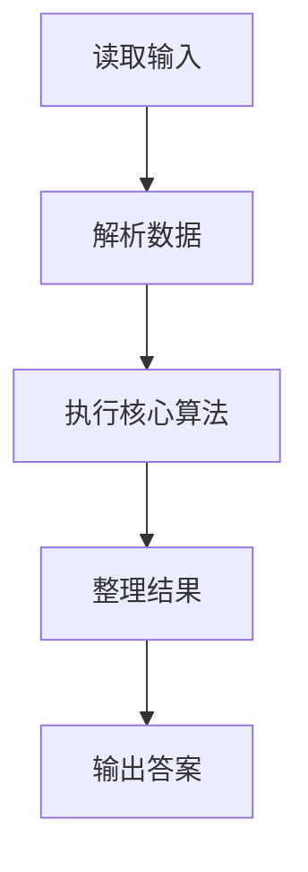
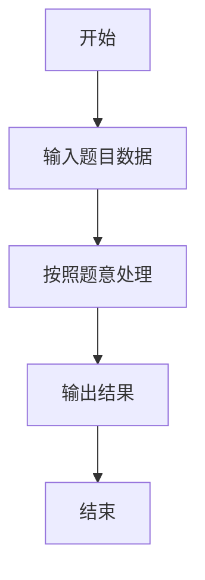

# L1-003 - 个位数统计（15 分）

- **时间限制**: 400 ms
- **内存限制**: 65536 KB
- **代码长度限制**: 16 KB

---

## 题目描述


给定一个 $$k$$ 位整数 $$N = d_{k-1}10^{k-1} + \cdots + d_1 10^1 + d_0$$ ($$0\le d_i \le 9$$, $$i=0,\cdots ,k-1$$, $$d_{k-1}>0$$)，请编写程序统计每种不同的个位数字出现的次数。例如：给定 $$N = 100311$$，则有 2 个 0，3 个 1，和 1 个 3。

### 输入格式:

每个输入包含 1 个测试用例，即一个不超过 1000 位的正整数 $$N$$。

### 输出格式:

对 $$N$$ 中每一种不同的个位数字，以 `D:M` 的格式在一行中输出该位数字 `D` 及其在 $$N$$ 中出现的次数 `M`。要求按 `D` 的升序输出。

### 输入样例:
```in
100311
```

### 输出样例:
```out
0:2
1:3
3:1
```

## 示例

### 示例 1

**输入:**
```
100311
```

**输出:**
```
0:2
1:3
3:1
```

### 解题思路

本题的 Ruby 实现采用字符串解析与规则处理。程序先读取题目输入，建立与题意对应的数据结构，按照约束完成核心计算，并按规定格式输出结果。具体实现以同目录的 main.rb 为准。

### 代码流程说明

1. 读取并解析标准输入，转换为题目所需的数据结构。
2. 按题意执行核心算法，维护中间状态并处理边界情况。
3. 整理计算结果，按照输出格式生成答案。

### 代码实现

完整实现位于同目录的 [main.rb](./main.rb)，以下代码与该入口文件保持一致。

```ruby
# frozen_string_literal: true
require_relative '../gplt_runtime'
def entry
  s = py_input_data.strip
  c = ([0] * 10)
  for x in s
    c[(x.ord - 48)] += 1
  end
  for i, v in py_enumerate(c)
    if py_truth(v)
      py_print("%s:%s" % [i, v], sep: " ", ending: "\n")
    end
  end
end
entry
```

### 代码流程图



### 解题流程图


