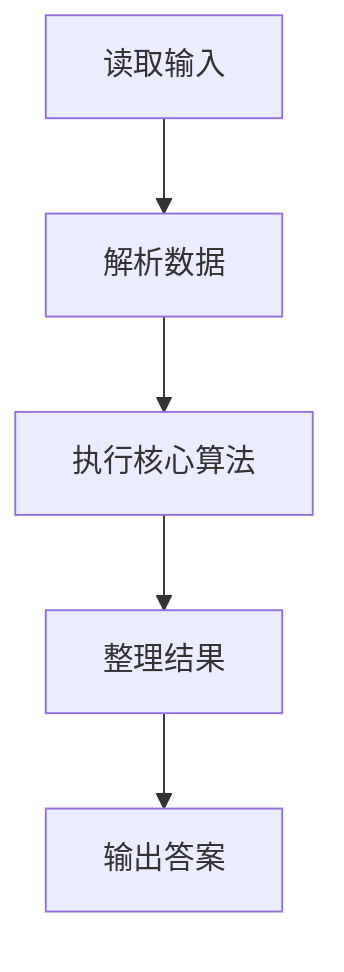
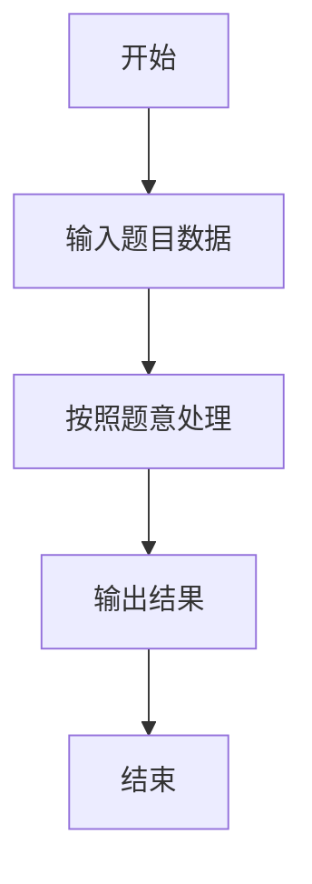

# L1-005 - 考试座位号（15 分）

- **时间限制**: 200 ms
- **内存限制**: 65536 KB
- **代码长度限制**: 16 KB

---

## 题目描述


每个 PAT 考生在参加考试时都会被分配两个座位号，一个是试机座位，一个是考试座位。正常情况下，考生在入场时先得到试机座位号码，入座进入试机状态后，系统会显示该考生的考试座位号码，考试时考生需要换到考试座位就座。但有些考生迟到了，试机已经结束，他们只能拿着领到的试机座位号码求助于你，从后台查出他们的考试座位号码。

### 输入格式:

输入第一行给出一个正整数 $$N$$（$$\le 1000$$），随后 $$N$$ 行，每行给出一个考生的信息：`准考证号 试机座位号 考试座位号`。其中`准考证号`由 16 位数字组成，座位从 1 到 $$N$$ 编号。输入保证每个人的准考证号都不同，并且任何时候都不会把两个人分配到同一个座位上。

考生信息之后，给出一个正整数 $$M$$（$$\le N$$），随后一行中给出 $$M$$ 个待查询的试机座位号码，以空格分隔。

### 输出格式:

对应每个需要查询的试机座位号码，在一行中输出对应考生的准考证号和考试座位号码，中间用 1 个空格分隔。

### 输入样例:
```in
4
3310120150912233 2 4
3310120150912119 4 1
3310120150912126 1 3
3310120150912002 3 2
2
3 4
```

### 输出样例:
```out
3310120150912002 2
3310120150912119 1
```

## 示例

### 示例 1

**输入:**
```
4
3310120150912233 2 4
3310120150912119 4 1
3310120150912126 1 3
3310120150912002 3 2
2
3 4
```

**输出:**
```
3310120150912002 2
3310120150912119 1
```

### 解题思路

本题的 Ruby 实现采用字符串解析与规则处理。程序先读取题目输入，建立与题意对应的数据结构，按照约束完成核心计算，并按规定格式输出结果。具体实现以同目录的 main.rb 为准。

### 代码流程说明

1. 读取并解析标准输入，转换为题目所需的数据结构。
2. 按题意执行核心算法，维护中间状态并处理边界情况。
3. 整理计算结果，按照输出格式生成答案。

### 代码实现

完整实现位于同目录的 [main.rb](./main.rb)，以下代码与该入口文件保持一致。

```ruby
# frozen_string_literal: true
require_relative '../gplt_runtime'

def entry
  it = py_iter(py_tokens)
  n = py_int(py_next(it))
  lookup = {}
  n.times do
    student = py_next(it).to_s
    test_id = py_next(it).to_s
    final_id = py_next(it).to_s
    lookup[test_id] = [student, final_id]
  end
  m = py_int(py_next(it))
  answers = m.times.map { lookup.fetch(py_next(it).to_s).join(' ') }
  py_print(answers.join("\n"))
end

entry
```

### 代码流程图



### 解题流程图


