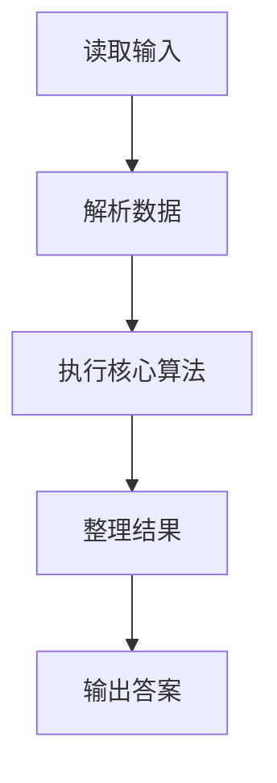
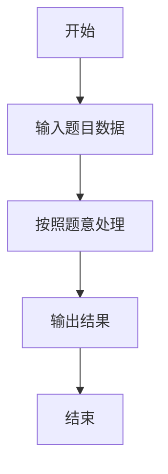

# L1-006 - 连续因子（20 分）

- **时间限制**: 400 ms
- **内存限制**: 65536 KB
- **代码长度限制**: 16 KB

---

## 题目描述


一个正整数 $$N$$ 的因子中可能存在若干连续的数字。例如 630 可以分解为 3$$\times$$5$$\times$$6$$\times$$7，其中 5、6、7 就是 3 个连续的数字。给定任一正整数 $$N$$，要求编写程序求出最长连续因子的个数，并输出最小的连续因子序列。

### 输入格式:

输入在一行中给出一个正整数 $$N$$（$$1<N<2^{31}$$）。

### 输出格式:

首先在第 1 行输出最长连续因子的个数；然后在第 2 行中按 `因子1*因子2*……*因子k` 的格式输出最小的连续因子序列，其中因子按递增顺序输出，1 不算在内。

### 输入样例:
```in
630
```

### 输出样例:
```out
3
5*6*7
```

## 示例

### 示例 1

**输入:**
```
630
```

**输出:**
```
3
5*6*7
```

### 解题思路

本题的 Ruby 实现采用字符串解析与规则处理。程序先读取题目输入，建立与题意对应的数据结构，按照约束完成核心计算，并按规定格式输出结果。具体实现以同目录的 main.rb 为准。

### 代码流程说明

1. 读取并解析标准输入，转换为题目所需的数据结构。
2. 按题意执行核心算法，维护中间状态并处理边界情况。
3. 整理计算结果，按照输出格式生成答案。

### 代码实现

完整实现位于同目录的 [main.rb](./L1-006_连续因子/main.rb)，以下代码与该入口文件保持一致。

```ruby
# frozen_string_literal: true
require_relative '../gplt_runtime'
def entry
  n = py_int(py_tokens[0])
  best_len = 1
  best_start = n
  for start in py_range(2, ((Math.sqrt(n).to_i) + 1))
    p = 1
    for py_end in py_range(start, ((Math.sqrt(n).to_i) + 1))
      p *= py_end
      if py_truth((n % p))
        break
      end
      if ((((py_end - start) + 1) > best_len))
        best_len = ((py_end - start) + 1)
        best_start = start
      end
    end
  end
  py_print(best_len, sep: " ", ending: "\n")
  py_print(py_iterable(py_range(best_len)).flat_map { |i|; [py_str((best_start + i))] }.join("*"), sep: " ", ending: "\n")
end
entry
```

### 代码流程图



### 解题流程图


