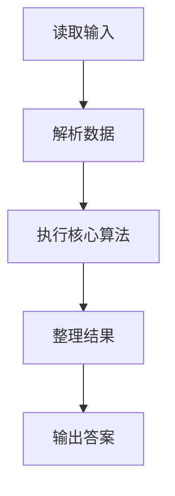
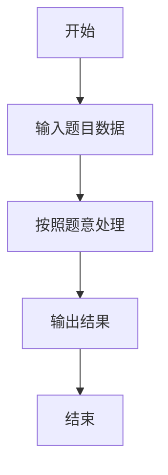

# L1-007 - 念数字（10 分）

- **时间限制**: 400 ms
- **内存限制**: 65536 KB
- **代码长度限制**: 16 KB

---

## 题目描述


输入一个整数，输出每个数字对应的拼音。当整数为负数时，先输出`fu`字。十个数字对应的拼音如下：
```
0: ling
1: yi
2: er
3: san
4: si
5: wu
6: liu
7: qi
8: ba
9: jiu
```

### 输入格式:

输入在一行中给出一个整数，如：`1234`。

<b>提示：整数包括负数、零和正数。</b>

### 输出格式:

在一行中输出这个整数对应的拼音，每个数字的拼音之间用空格分开，行末没有最后的空格。如
`yi er san si`。

### 输入样例:
```in
-600
```

### 输出样例:
```out
fu liu ling ling
```

## 示例

### 示例 1

**输入:**
```
-600
```

**输出:**
```
fu liu ling ling
```

### 解题思路

本题的 Ruby 实现采用字符串解析与规则处理。程序先读取题目输入，建立与题意对应的数据结构，按照约束完成核心计算，并按规定格式输出结果。具体实现以同目录的 main.rb 为准。

### 代码流程说明

1. 读取并解析标准输入，转换为题目所需的数据结构。
2. 按题意执行核心算法，维护中间状态并处理边界情况。
3. 整理计算结果，按照输出格式生成答案。

### 代码实现

完整实现位于同目录的 [main.rb](./L1-007_念数字/main.rb)，以下代码与该入口文件保持一致。

```ruby
# frozen_string_literal: true
require_relative '../gplt_runtime'
def entry
  s = py_input_data.strip
  p = "ling yi er san si wu liu qi ba jiu".split()
  py_print(py_iterable(s).flat_map { |c|; [(((c == "-")) ? "fu" : p[(c.ord - 48)])] }.join(" "), sep: " ", ending: "\n")
end
entry
```

### 代码流程图



### 解题流程图


