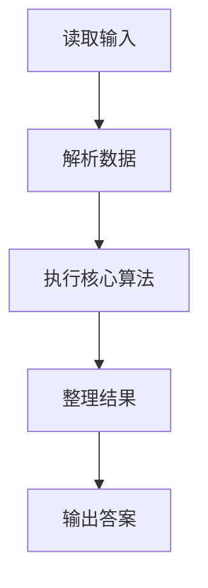
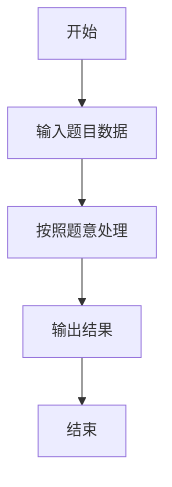

# L1-008 - 求整数段和（10 分）

- **时间限制**: 400 ms
- **内存限制**: 65536 KB
- **代码长度限制**: 16 KB

---

## 题目描述


给定两个整数$$A$$和$$B$$，输出从$$A$$到$$B$$的所有整数以及这些数的和。

### 输入格式:

输入在一行中给出2个整数$$A$$和$$B$$，其中$$-100\le A\le B\le 100$$，其间以空格分隔。

### 输出格式:

首先顺序输出从$$A$$到$$B$$的所有整数，每5个数字占一行，每个数字占5个字符宽度，向右对齐。最后在一行中按`Sum = X`的格式输出全部数字的和`X`。

### 输入样例:
```in
-3 8
```

### 输出样例:
```out
-3   -2   -1    0    1
    2    3    4    5    6
    7    8
Sum = 30
```

## 示例

### 示例 1

**输入:**
```
-3 8
```

**输出:**
```
-3   -2   -1    0    1
    2    3    4    5    6
    7    8
Sum = 30
```

### 解题思路

本题的 Ruby 实现采用字符串解析与规则处理。程序先读取题目输入，建立与题意对应的数据结构，按照约束完成核心计算，并按规定格式输出结果。具体实现以同目录的 main.rb 为准。

### 代码流程说明

1. 读取并解析标准输入，转换为题目所需的数据结构。
2. 按题意执行核心算法，维护中间状态并处理边界情况。
3. 整理计算结果，按照输出格式生成答案。

### 代码实现

完整实现位于同目录的 [main.rb](./main.rb)，以下代码与该入口文件保持一致。

```ruby
# frozen_string_literal: true
require_relative '../gplt_runtime'

def entry
  x, y = py_tokens.first(2).map(&:to_i)
  values = (x..y).to_a
  lines = values.each_slice(5).map.with_index do |group, row|
    group.map.with_index { |value, index| row.zero? && index.zero? ? value.to_s : format('%5d', value) }.join
  end
  py_print(lines.join("\n"))
  py_print("Sum = #{values.sum}")
end

entry
```

### 代码流程图



### 解题流程图


