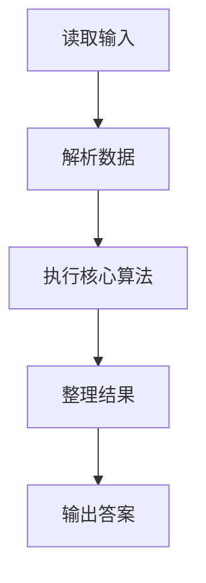
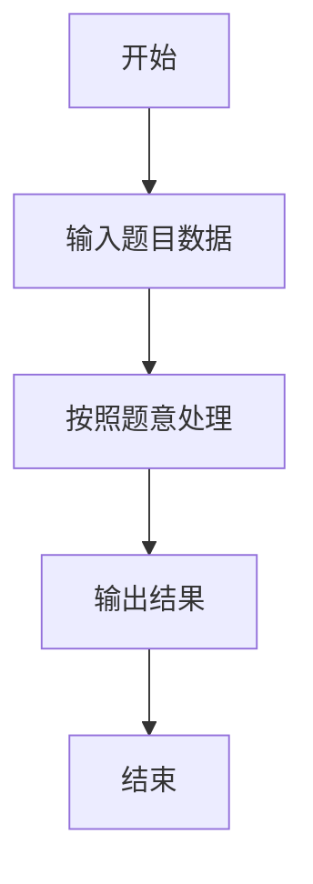

# L1-009 - N个数求和（20 分）

- **时间限制**: 400 ms
- **内存限制**: 65536 KB
- **代码长度限制**: 16 KB

---

## 题目描述


本题的要求很简单，就是求`N`个数字的和。麻烦的是，这些数字是以有理数`分子/分母`的形式给出的，你输出的和也必须是有理数的形式。

### 输入格式:

输入第一行给出一个正整数`N`（$$\le$$100）。随后一行按格式`a1/b1 a2/b2 ...`给出`N`个有理数。题目保证所有分子和分母都在长整型范围内。另外，负数的符号一定出现在分子前面。

### 输出格式:

输出上述数字和的最简形式 —— 即将结果写成`整数部分 分数部分`，其中分数部分写成`分子/分母`，要求分子小于分母，且它们没有公因子。如果结果的整数部分为0，则只输出分数部分。

### 输入样例 1：
```in
5
2/5 4/15 1/30 -2/60 8/3
```

### 输出样例 1：
```out
3 1/3
```

### 输入样例 2：
```in
2
4/3 2/3
```

### 输出样例 2：
```out
2
```

### 输入样例 3：
```in
3
1/3 -1/6 1/8
```

### 输出样例 3：
```out
7/24
```

## 示例

### 示例 1

**输入:**
```
5
2/5 4/15 1/30 -2/60 8/3
```

**输出:**
```
3 1/3
```

### 示例 2

**输入:**
```
2
4/3 2/3
```

**输出:**
```
2
```

### 示例 3

**输入:**
```
3
1/3 -1/6 1/8
```

**输出:**
```
7/24
```

### 解题思路

本题的 Ruby 实现采用字符串解析与规则处理。程序先读取题目输入，建立与题意对应的数据结构，按照约束完成核心计算，并按规定格式输出结果。具体实现以同目录的 main.rb 为准。

### 代码流程说明

1. 读取并解析标准输入，转换为题目所需的数据结构。
2. 按题意执行核心算法，维护中间状态并处理边界情况。
3. 整理计算结果，按照输出格式生成答案。

### 代码实现

完整实现位于同目录的 [main.rb](./main.rb)，以下代码与该入口文件保持一致。

```ruby
# frozen_string_literal: true
require_relative '../gplt_runtime'
def entry
  it = py_iter(py_tokens)
  n = py_int(py_next(it))
  num, den = [0, 1]
  for _ in py_range(n)
    a, b = py_map(->(x) { py_int(x) }, py_next(it).to_s.split("/"))
    num = ((num * b) + (a * den))
    den *= b
    g = py_gcd(num, den)
    num = num.div(g)
    den = den.div(g)
  end
  if ((num == 0))
    py_print(0, sep: " ", ending: "\n")
    else
      q, r = py_divmod(py_abs(num), den)
      sign = (((num < 0)) ? "-" : "")
      if py_truth(q)
        integer_part = "%s%s" % [sign, q]
        fraction_part = r.zero? ? "" : (" %s/%s" % [r, den])
        py_print(integer_part + fraction_part, sep: " ", ending: "\n")
        else
          py_print("%s%s/%s" % [sign, r, den], sep: " ", ending: "\n")
      end
  end
end
entry
```

### 代码流程图



### 解题流程图


