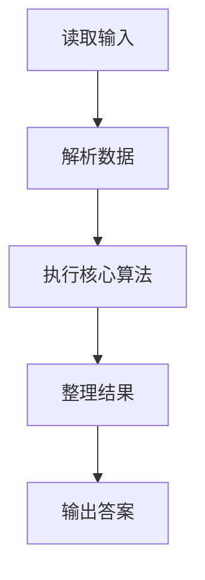
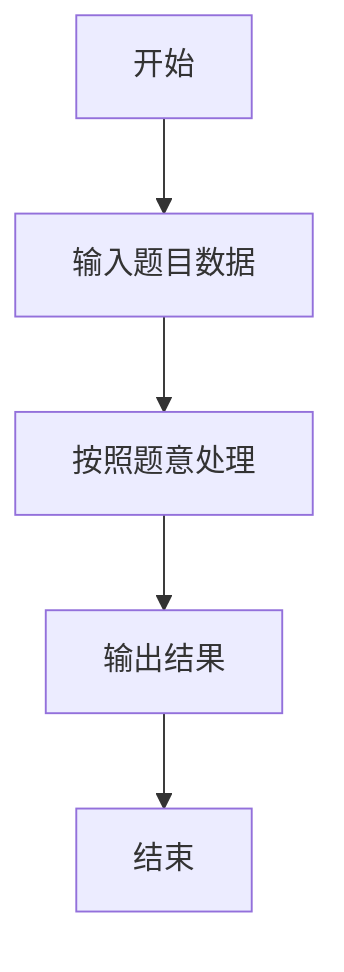

# L1-012 - 计算指数（5 分）

- **时间限制**: 400 ms
- **内存限制**: 65536 KB
- **代码长度限制**: 16 KB

---

## 题目描述


真的没骗你，这道才是简单题 —— 对任意给定的不超过 10 的正整数 $$n$$，要求你输出 $$2^n$$。不难吧？

### 输入格式:

输入在一行中给出一个不超过 10 的正整数 $$n$$。

### 输出格式:

在一行中按照格式  `2^n = 计算结果`  输出 $$2^n$$ 的值。

### 输入样例:
```in
5
```

### 输出样例:
```out
2^5 = 32
```

## 示例

### 示例 1

**输入:**
```
5
```

**输出:**
```
2^5 = 32
```

### 解题思路

本题的 Ruby 实现采用字符串解析与规则处理。程序先读取题目输入，建立与题意对应的数据结构，按照约束完成核心计算，并按规定格式输出结果。具体实现以同目录的 main.rb 为准。

### 代码流程说明

1. 读取并解析标准输入，转换为题目所需的数据结构。
2. 按题意执行核心算法，维护中间状态并处理边界情况。
3. 整理计算结果，按照输出格式生成答案。

### 代码实现

完整实现位于同目录的 [main.rb](./L1-012_计算指数/main.rb)，以下代码与该入口文件保持一致。

```ruby
# frozen_string_literal: true
require_relative '../gplt_runtime'
n = py_tokens.first.to_i
py_print("2^#{n} = #{2**n}")
```

### 代码流程图



### 解题流程图


