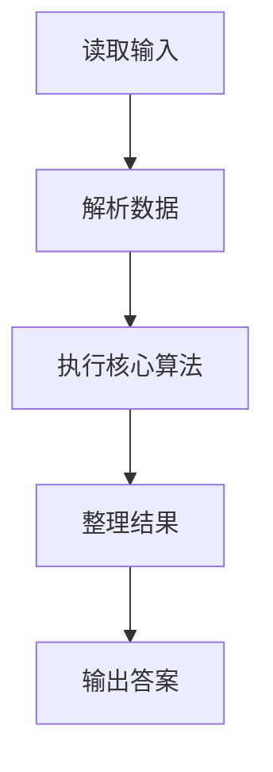
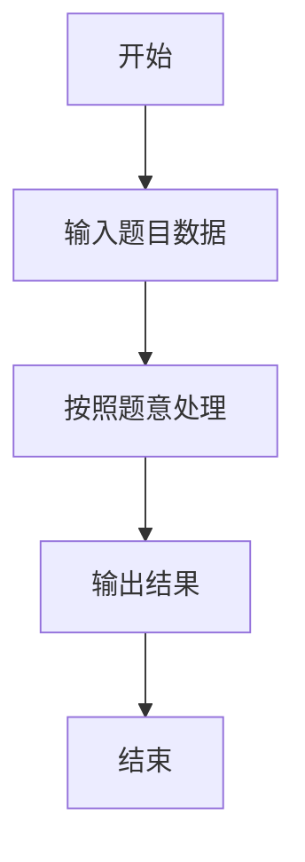

# L1-015 - 跟奥巴马一起画方块（15 分）

- **时间限制**: 400 ms
- **内存限制**: 65536 KB
- **代码长度限制**: 16 KB

---

## 题目描述


美国总统奥巴马不仅呼吁所有人都学习编程，甚至以身作则编写代码，成为美国历史上首位编写计算机代码的总统。2014年底，为庆祝“计算机科学教育周”正式启动，奥巴马编写了很简单的计算机代码：在屏幕上画一个正方形。现在你也跟他一起画吧！

### 输入格式:

输入在一行中给出正方形边长$$N$$（$$3\le N\le 21$$）和组成正方形边的某种字符`C`，间隔一个空格。

### 输出格式:

输出由给定字符`C`画出的正方形。但是注意到行间距比列间距大，所以为了让结果看上去更像正方形，我们输出的行数实际上是列数的50%（四舍五入取整）。

### 输入样例:
```in
10 a
```

### 输出样例:
```out
aaaaaaaaaa
aaaaaaaaaa
aaaaaaaaaa
aaaaaaaaaa
aaaaaaaaaa
```

## 示例

### 示例 1

**输入:**
```
10 a
```

**输出:**
```
aaaaaaaaaa
aaaaaaaaaa
aaaaaaaaaa
aaaaaaaaaa
aaaaaaaaaa
```

### 解题思路

本题的 Ruby 实现采用字符串解析与规则处理。程序先读取题目输入，建立与题意对应的数据结构，按照约束完成核心计算，并按规定格式输出结果。具体实现以同目录的 main.rb 为准。

### 代码流程说明

1. 读取并解析标准输入，转换为题目所需的数据结构。
2. 按题意执行核心算法，维护中间状态并处理边界情况。
3. 整理计算结果，按照输出格式生成答案。

### 代码实现

完整实现位于同目录的 [main.rb](./main.rb)，以下代码与该入口文件保持一致。

```ruby
# frozen_string_literal: true
require_relative '../gplt_runtime'
def entry
  n, c = py_tokens
  n = py_int(n)
  c = c.to_s
  py_print(([(c * n)] * ((n + 1).div(2))).join("\n"), sep: " ", ending: "\n")
end
entry
```

### 代码流程图



### 解题流程图


