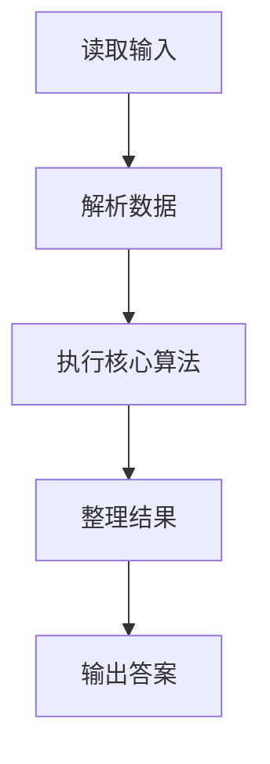
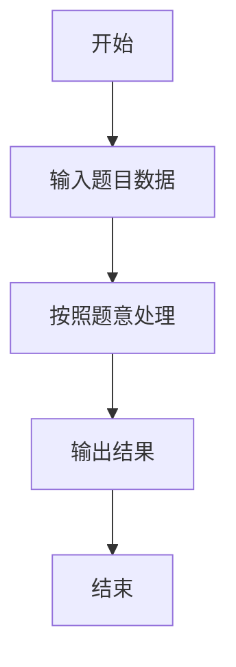

# L1-016 - 查验身份证（15 分）

- **时间限制**: 400 ms
- **内存限制**: 65536 KB
- **代码长度限制**: 16 KB

---

## 题目描述


一个合法的身份证号码由17位地区、日期编号和顺序编号加1位校验码组成。校验码的计算规则如下：

首先对前17位数字加权求和，权重分配为：{7，9，10，5，8，4，2，1，6，3，7，9，10，5，8，4，2}；然后将计算的和对11取模得到值`Z`；最后按照以下关系对应`Z`值与校验码`M`的值：
```
Z：0 1 2 3 4 5 6 7 8 9 10
M：1 0 X 9 8 7 6 5 4 3 2
```
现在给定一些身份证号码，请你验证校验码的有效性，并输出有问题的号码。

### 输入格式:

输入第一行给出正整数$$N$$（$$\le 100$$）是输入的身份证号码的个数。随后$$N$$行，每行给出1个18位身份证号码。

### 输出格式:

按照输入的顺序每行输出1个有问题的身份证号码。这里并不检验前17位是否合理，只检查前17位是否全为数字且最后1位校验码计算准确。如果所有号码都正常，则输出`All passed`。

### 输入样例 1：
```in
4
320124198808240056
12010X198901011234
110108196711301866
37070419881216001X
```

### 输出样例 1：
```out
12010X198901011234
110108196711301866
37070419881216001X
```

### 输入样例 2：
```in
2
320124198808240056
110108196711301862
```

### 输出样例 2：
```out
All passed
```

## 示例

### 示例 1

**输入:**
```
4
320124198808240056
12010X198901011234
110108196711301866
37070419881216001X
```

**输出:**
```
12010X198901011234
110108196711301866
37070419881216001X
```

### 示例 2

**输入:**
```
2
320124198808240056
110108196711301862
```

**输出:**
```
All passed
```

### 解题思路

本题的 Ruby 实现采用字符串解析与规则处理。程序先读取题目输入，建立与题意对应的数据结构，按照约束完成核心计算，并按规定格式输出结果。具体实现以同目录的 main.rb 为准。

### 代码流程说明

1. 读取并解析标准输入，转换为题目所需的数据结构。
2. 按题意执行核心算法，维护中间状态并处理边界情况。
3. 整理计算结果，按照输出格式生成答案。

### 代码实现

完整实现位于同目录的 [main.rb](./L1-016_查验身份证/main.rb)，以下代码与该入口文件保持一致。

```ruby
# frozen_string_literal: true
require_relative '../gplt_runtime'

tokens = py_tokens
n = tokens.shift.to_i
weights = [7, 9, 10, 5, 8, 4, 2, 1, 6, 3, 7, 9, 10, 5, 8, 4, 2]
check = '10X98765432'
bad = []
n.times do
  id = tokens.shift.to_s
  valid = id.length == 18 && id[0, 17].match?(/\A\d+\z/)
  if valid
    sum = id.chars.first(17).each_with_index.sum { |c, i| c.to_i * weights[i] }
    valid = check[sum % 11] == id[-1]
  end
  bad << id unless valid
end
py_print(bad.empty? ? 'All passed' : bad.join("\n"))
```

### 代码流程图



### 解题流程图


