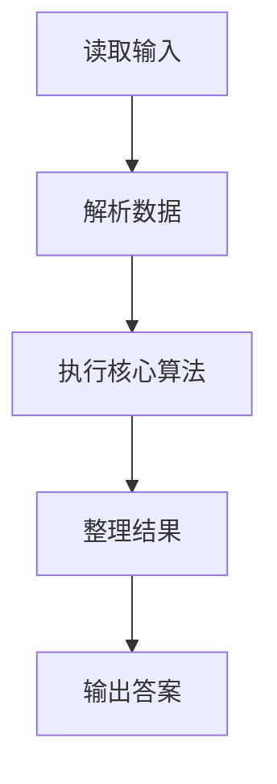
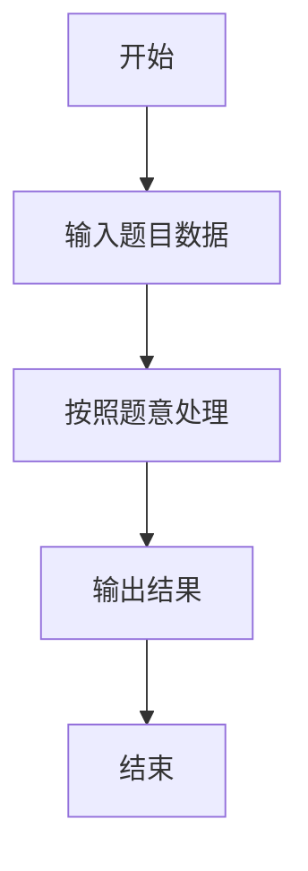

# L1-017 - 到底有多二（15 分）

- **时间限制**: 400 ms
- **内存限制**: 65536 KB
- **代码长度限制**: 16 KB

---

## 题目描述


一个整数“**犯二的程度**”定义为该数字中包含2的个数与其位数的比值。如果这个数是负数，则程度增加0.5倍；如果还是个偶数，则再增加1倍。例如数字`-13142223336`是个11位数，其中有3个2，并且是负数，也是偶数，则它的犯二程度计算为：$$3/11\times 1.5\times 2\times 100\%$$，约为81.82%。本题就请你计算一个给定整数到底有多二。

### 输入格式:

输入第一行给出一个不超过50位的整数`N`。

### 输出格式:

在一行中输出`N`犯二的程度，保留小数点后两位。

### 输入样例:
```in
-13142223336
```

### 输出样例:
```out
81.82%
```

## 示例

### 示例 1

**输入:**
```
-13142223336
```

**输出:**
```
81.82%
```

### 解题思路

本题的 Ruby 实现采用字符串解析与规则处理。程序先读取题目输入，建立与题意对应的数据结构，按照约束完成核心计算，并按规定格式输出结果。具体实现以同目录的 main.rb 为准。

### 代码流程说明

1. 读取并解析标准输入，转换为题目所需的数据结构。
2. 按题意执行核心算法，维护中间状态并处理边界情况。
3. 整理计算结果，按照输出格式生成答案。

### 代码实现

完整实现位于同目录的 [main.rb](./main.rb)，以下代码与该入口文件保持一致。

```ruby
# frozen_string_literal: true
require_relative '../gplt_runtime'
def entry
  s = py_input_data.strip
  t = py_lstrip(s, "-")
  v = py_div((t.count("2") * 100), py_len(t))
  if ((s[0] == "-"))
    v *= 1.5
  end
  if (((py_int(t[(-1)]) % 2) == 0))
    v *= 2
  end
  py_print("%.2f%%" % [v], sep: " ", ending: "\n")
end
entry
```

### 代码流程图



### 解题流程图


