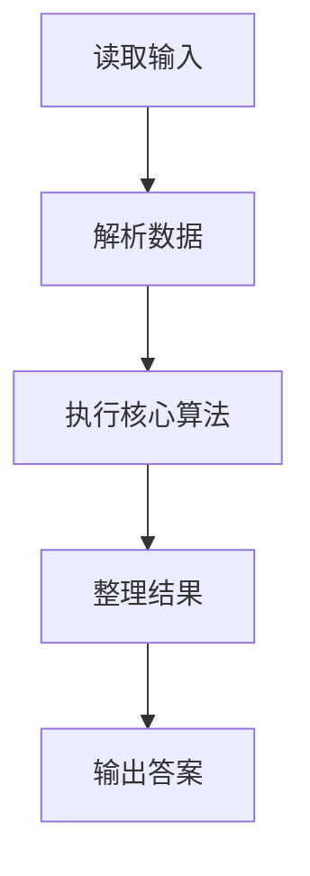
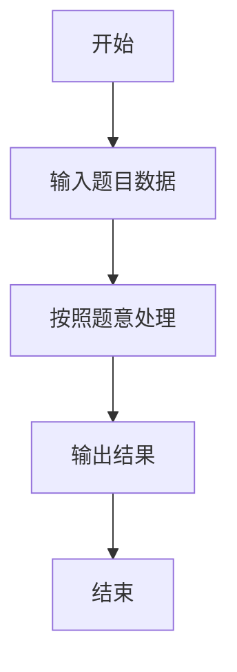

# L1-018 - 大笨钟（10 分）

- **时间限制**: 400 ms
- **内存限制**: 65536 KB
- **代码长度限制**: 16 KB

---

## 题目描述


微博上有个自称“大笨钟V”的家伙，每天敲钟催促码农们爱惜身体早点睡觉。不过由于笨钟自己作息也不是很规律，所以敲钟并不定时。一般敲钟的点数是根据敲钟时间而定的，如果正好在某个整点敲，那么“当”数就等于那个整点数；如果过了整点，就敲下一个整点数。另外，虽然一天有24小时，钟却是只在后半天敲1~12下。例如在23:00敲钟，就是“当当当当当当当当当当当”，而到了23:01就会是“当当当当当当当当当当当当”。在午夜00:00到中午12:00期间（端点时间包括在内），笨钟是不敲的。

下面就请你写个程序，根据当前时间替大笨钟敲钟。

### 输入格式:

输入第一行按照`hh:mm`的格式给出当前时间。其中`hh`是小时，在00到23之间；`mm`是分钟，在00到59之间。

### 输出格式:

根据当前时间替大笨钟敲钟，即在一行中输出相应数量个`Dang`。如果不是敲钟期，则输出：

```
Only hh:mm.  Too early to Dang.
```

其中`hh:mm`是输入的时间。

### 输入样例 1：
```in
19:05
```

### 输出样例 1：
```out
DangDangDangDangDangDangDangDang
```

### 输入样例 2：
```in
07:05
```

### 输出样例 2：
```out
Only 07:05.  Too early to Dang.
```

## 示例

### 示例 1

**输入:**
```
19:05
```

**输出:**
```
DangDangDangDangDangDangDangDang
```

### 示例 2

**输入:**
```
07:05
```

**输出:**
```
Only 07:05.  Too early to Dang.
```

### 解题思路

本题的 Ruby 实现采用字符串解析与规则处理。程序先读取题目输入，建立与题意对应的数据结构，按照约束完成核心计算，并按规定格式输出结果。具体实现以同目录的 main.rb 为准。

### 代码流程说明

1. 读取并解析标准输入，转换为题目所需的数据结构。
2. 按题意执行核心算法，维护中间状态并处理边界情况。
3. 整理计算结果，按照输出格式生成答案。

### 代码实现

完整实现位于同目录的 [main.rb](./main.rb)，以下代码与该入口文件保持一致。

```ruby
# frozen_string_literal: true
require_relative '../gplt_runtime'
def entry
  s = py_input_data.strip
  h, m = py_map(->(x) { py_int(x) }, s.split(":"))
  if (((h < 12)) || (((h == 12)) && ((m == 0))))
    py_print("Only %s.  Too early to Dang." % [s], sep: " ", ending: "\n")
    else
      py_print(("Dang" * ((h - 12) + py_bool_int(((m > 0))))), sep: " ", ending: "\n")
  end
end
entry
```

### 代码流程图



### 解题流程图


