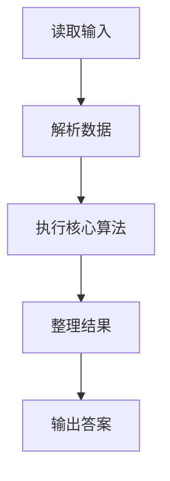
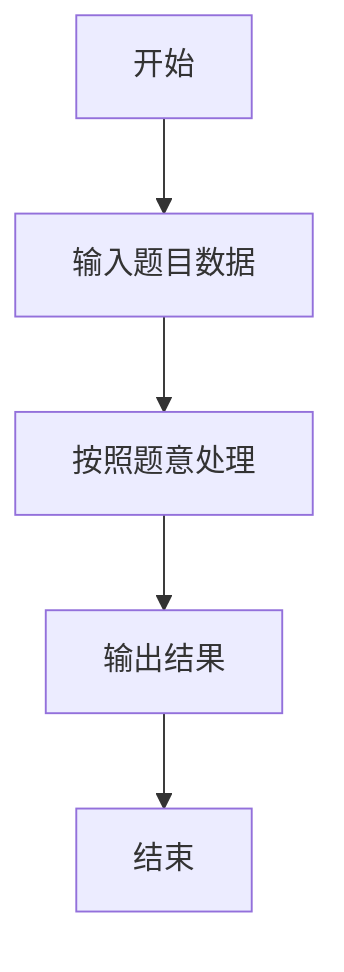

# L1-022 - 奇偶分家（10 分）

- **时间限制**: 400 ms
- **内存限制**: 65536 KB
- **代码长度限制**: 16 KB

---

## 题目描述


给定`N`个正整数，请统计奇数和偶数各有多少个？

### 输入格式:

输入第一行给出一个正整`N`（$$\le 1000$$）；第2行给出`N`个非负整数，以空格分隔。

### 输出格式:

在一行中先后输出奇数的个数、偶数的个数。中间以1个空格分隔。

### 输入样例:
```in
9
88 74 101 26 15 0 34 22 77
```

### 输出样例:
```out
3 6
```

## 示例

### 示例 1

**输入:**
```
9
88 74 101 26 15 0 34 22 77
```

**输出:**
```
3 6
```

### 解题思路

本题的 Ruby 实现采用字符串解析与规则处理。程序先读取题目输入，建立与题意对应的数据结构，按照约束完成核心计算，并按规定格式输出结果。具体实现以同目录的 main.rb 为准。

### 代码流程说明

1. 读取并解析标准输入，转换为题目所需的数据结构。
2. 按题意执行核心算法，维护中间状态并处理边界情况。
3. 整理计算结果，按照输出格式生成答案。

### 代码实现

完整实现位于同目录的 [main.rb](./main.rb)，以下代码与该入口文件保持一致。

```ruby
# frozen_string_literal: true
require_relative '../gplt_runtime'
def entry
  it = py_iter(py_map(->(x) { py_int(x) }, py_tokens))
  n = py_next(it)
  a = py_iterable(py_range(n)).flat_map { |_|; [py_next(it)] }
  py_print(py_sum(py_iterable(a).flat_map { |x|; [(x % 2)] }), py_sum(py_iterable(a).flat_map { |x|; [(((x % 2) == 0))] }), sep: " ", ending: "\n")
end
entry
```

### 代码流程图



### 解题流程图


