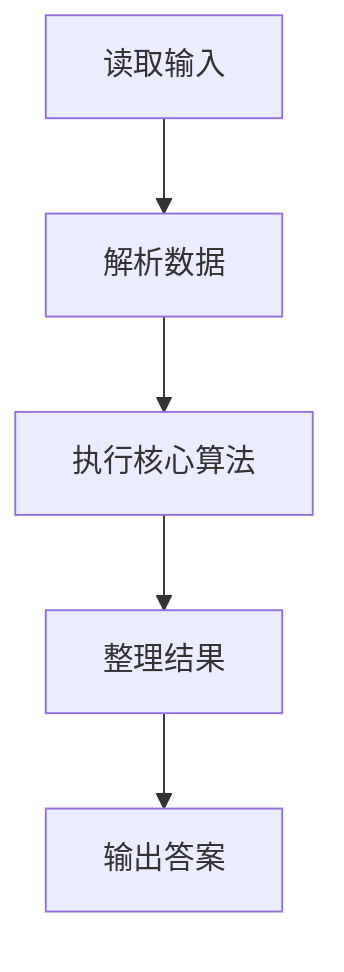
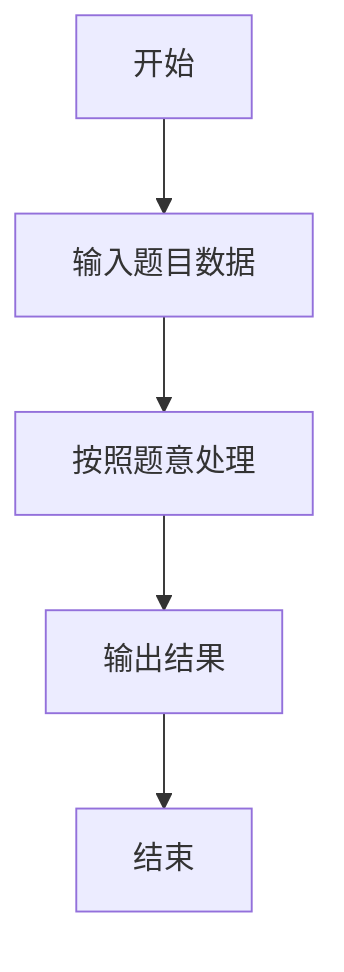

# L1-025 - 正整数A+B（15 分）

- **时间限制**: 400 ms
- **内存限制**: 65536 KB
- **代码长度限制**: 16 KB

---

## 题目描述


题的目标很简单，就是求两个正整数`A`和`B`的和，其中`A`和`B`都在区间[1,1000]。稍微有点麻烦的是，输入并不保证是两个正整数。

### 输入格式:

输入在一行给出`A`和`B`，其间以空格分开。问题是`A`和`B`不一定是满足要求的正整数，有时候可能是超出范围的数字、负数、带小数点的实数、甚至是一堆乱码。

注意：我们把输入中出现的第1个空格认为是`A`和`B`的分隔。题目保证至少存在一个空格，并且`B`不是一个空字符串。

### 输出格式:

如果输入的确是两个正整数，则按格式`A + B = 和`输出。如果某个输入不合要求，则在相应位置输出`?`，显然此时和也是`?`。

### 输入样例 1：
```in
123 456
```

### 输出样例 1：
```out
123 + 456 = 579
```

### 输入样例 2：
```in
22. 18
```

### 输出样例 2：
```out
? + 18 = ?
```

### 输入样例 3：
```in
-100 blabla bla...33
```

### 输出样例 3：
```out
? + ? = ?
```

## 示例

### 示例 1

**输入:**
```
123 456
```

**输出:**
```
123 + 456 = 579
```

### 示例 2

**输入:**
```
22. 18
```

**输出:**
```
? + 18 = ?
```

### 示例 3

**输入:**
```
-100 blabla bla...33
```

**输出:**
```
? + ? = ?
```

### 解题思路

本题的 Ruby 实现采用字符串解析与规则处理。程序先读取题目输入，建立与题意对应的数据结构，按照约束完成核心计算，并按规定格式输出结果。具体实现以同目录的 main.rb 为准。

### 代码流程说明

1. 读取并解析标准输入，转换为题目所需的数据结构。
2. 按题意执行核心算法，维护中间状态并处理边界情况。
3. 整理计算结果，按照输出格式生成答案。

### 代码实现

完整实现位于同目录的 [main.rb](./L1-025_正整数A+B/main.rb)，以下代码与该入口文件保持一致。

```ruby
# frozen_string_literal: true
require_relative '../gplt_runtime'
def entry
  p = py_readline.split
  p = py_slice((p + [""]), nil, 2, nil)
  f = lambda do |s|
    return ((py_truth((s.to_s.match?(/\A[0-9]+\z/))) && ((1 <= py_int(s)) && (py_int(s) <= 1000))) ? py_int(s) : nil)
  end
  a, b = [f.call(p[0]), f.call(p[1])]
  py_print("%s + %s = %s" % [(((!a.equal?(nil))) ? a : "?"), (((!b.equal?(nil))) ? b : "?"), ((((!a.equal?(nil))) && ((!b.equal?(nil)))) ? (a + b) : "?")], sep: " ", ending: "\n")
end
entry
```

### 代码流程图



### 解题流程图


