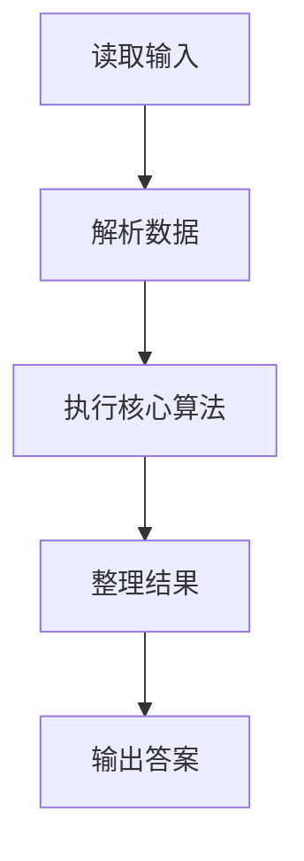
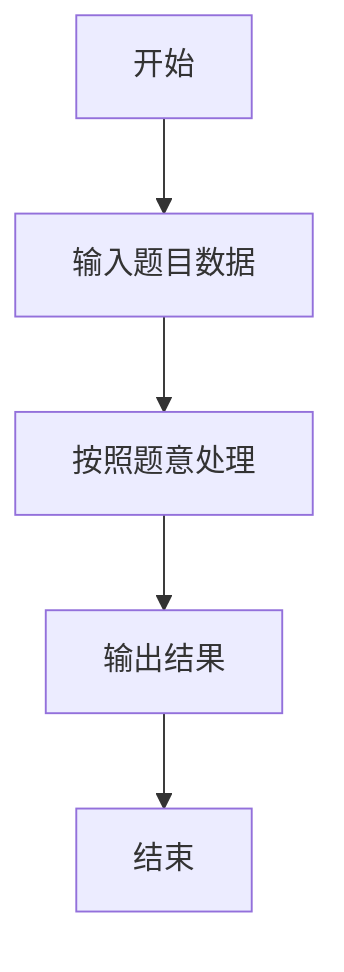

# L1-028 - 判断素数（10 分）

- **时间限制**: 400 ms
- **内存限制**: 65536 KB
- **代码长度限制**: 16 KB

---

## 题目描述


本题的目标很简单，就是判断一个给定的正整数是否素数。

### 输入格式:

输入在第一行给出一个正整数`N`（$$\le$$ 10），随后`N`行，每行给出一个小于$$2^{31}$$的需要判断的正整数。

### 输出格式:

对每个需要判断的正整数，如果它是素数，则在一行中输出`Yes`，否则输出`No`。

### 输入样例:
```in
2
11
111
```

### 输出样例:
```out
Yes
No
```

## 示例

### 示例 1

**输入:**
```
2
11
111
```

**输出:**
```
Yes
No
```

### 解题思路

本题的 Ruby 实现采用字符串解析与规则处理。程序先读取题目输入，建立与题意对应的数据结构，按照约束完成核心计算，并按规定格式输出结果。具体实现以同目录的 main.rb 为准。

### 代码流程说明

1. 读取并解析标准输入，转换为题目所需的数据结构。
2. 按题意执行核心算法，维护中间状态并处理边界情况。
3. 整理计算结果，按照输出格式生成答案。

### 代码实现

完整实现位于同目录的 [main.rb](./main.rb)，以下代码与该入口文件保持一致。

```ruby
# frozen_string_literal: true
require_relative '../gplt_runtime'
def entry
  it = py_iter(py_map(->(x) { py_int(x) }, py_tokens))
  n = py_next(it)
  prime = lambda do |x|
    return (((x >= 2)) && py_truth(py_iterable(py_range(2, ((Math.sqrt(x).to_i) + 1))).flat_map { |d|; [(x % d)] }.all?))
  end
  py_print(py_iterable(py_range(n)).flat_map { |_|; [(prime.call(py_next(it)) ? "Yes" : "No")] }.join("\n"), sep: " ", ending: "\n")
end
entry
```

### 代码流程图



### 解题流程图


