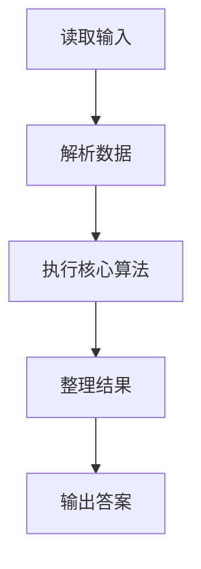
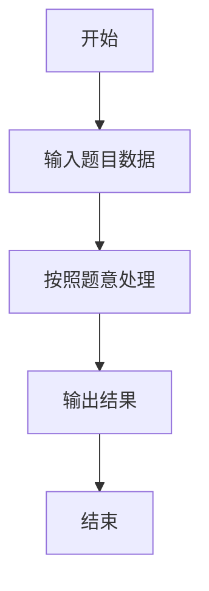

# L1-029 - 是不是太胖了（5 分）

- **时间限制**: 400 ms
- **内存限制**: 65536 KB
- **代码长度限制**: 16 KB

---

## 题目描述


据说一个人的标准体重应该是其身高（单位：厘米）减去100、再乘以0.9所得到的公斤数。已知市斤的数值是公斤数值的两倍。现给定某人身高，请你计算其标准体重应该是多少？（顺便也悄悄给自己算一下吧……）

### 输入格式:

输入第一行给出一个正整数`H`（100 $$<$$ `H` $$\le$$ 300），为某人身高。

### 输出格式:

在一行中输出对应的标准体重，单位为市斤，保留小数点后1位。

### 输入样例:
```in
169
```

### 输出样例:
```out
124.2
```

## 示例

### 示例 1

**输入:**
```
169
```

**输出:**
```
124.2
```

### 解题思路

本题的 Ruby 实现采用字符串解析与规则处理。程序先读取题目输入，建立与题意对应的数据结构，按照约束完成核心计算，并按规定格式输出结果。具体实现以同目录的 main.rb 为准。

### 代码流程说明

1. 读取并解析标准输入，转换为题目所需的数据结构。
2. 按题意执行核心算法，维护中间状态并处理边界情况。
3. 整理计算结果，按照输出格式生成答案。

### 代码实现

完整实现位于同目录的 [main.rb](./L1-029_是不是太胖了/main.rb)，以下代码与该入口文件保持一致。

```ruby
# frozen_string_literal: true
require_relative '../gplt_runtime'
def entry
  h = py_int(py_tokens[0])
  py_print("%.1f" % [((h - 100) * 1.8)], sep: " ", ending: "\n")
end
entry
```

### 代码流程图



### 解题流程图


