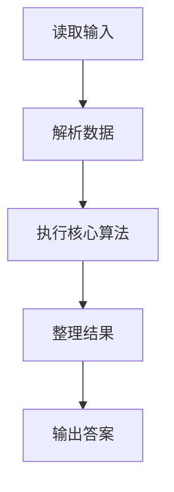
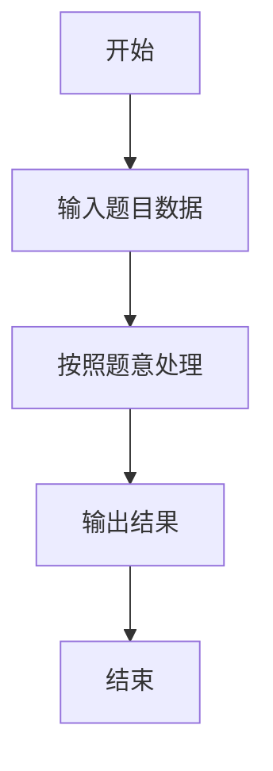

# L1-031 - 到底是不是太胖了（10 分）

- **时间限制**: 400 ms
- **内存限制**: 65536 KB
- **代码长度限制**: 16 KB

---

## 题目描述


据说一个人的标准体重应该是其身高（单位：厘米）减去100、再乘以0.9所得到的公斤数。真实体重与标准体重误差在10%以内都是完美身材（即 | 真实体重 $$-$$ 标准体重 | $$<$$ 标准体重$$\times 10\%$$）。已知 1 公斤等于 2 市斤。现给定一群人的身高和实际体重，请你告诉他们是否太胖或太瘦了。

### 输入格式:

输入第一行给出一个正整数`N`（$$\le$$ 20）。随后`N`行，每行给出两个整数，分别是一个人的身高`H`（120 $$<$$ `H` $$<$$ 200；单位：厘米）和真实体重`W`（50 $$<$$ `W` $$\le$$ 300；单位：市斤），其间以空格分隔。

### 输出格式:

为每个人输出一行结论：如果是完美身材，输出`You are wan mei!`；如果太胖了，输出`You are tai pang le!`；否则输出`You are tai shou le!`。

### 输入样例:
```in
3
169 136
150 81
178 155
```

### 输出样例:
```out
You are wan mei!
You are tai shou le!
You are tai pang le!
```

## 示例

### 示例 1

**输入:**
```
3
169 136
150 81
178 155
```

**输出:**
```
You are wan mei!
You are tai shou le!
You are tai pang le!
```

### 解题思路

本题的 Ruby 实现采用字符串解析与规则处理。程序先读取题目输入，建立与题意对应的数据结构，按照约束完成核心计算，并按规定格式输出结果。具体实现以同目录的 main.rb 为准。

### 代码流程说明

1. 读取并解析标准输入，转换为题目所需的数据结构。
2. 按题意执行核心算法，维护中间状态并处理边界情况。
3. 整理计算结果，按照输出格式生成答案。

### 代码实现

完整实现位于同目录的 [main.rb](./main.rb)，以下代码与该入口文件保持一致。

```ruby
# frozen_string_literal: true
require_relative '../gplt_runtime'
def entry
  it = py_iter(py_map(->(x) { py_int(x) }, py_tokens))
  out = []
  for _ in py_range(py_next(it))
    h, w = [py_next(it), py_next(it)]
    st = ((h - 100) * 1.8)
    out.append(((((st * 0.9) < w) && (w < (st * 1.1))) ? "You are wan mei!" : (((w <= (st * 0.9))) ? "You are tai shou le!" : "You are tai pang le!")))
  end
  py_print(out.join("\n"), sep: " ", ending: "\n")
end
entry
```

### 代码流程图



### 解题流程图


