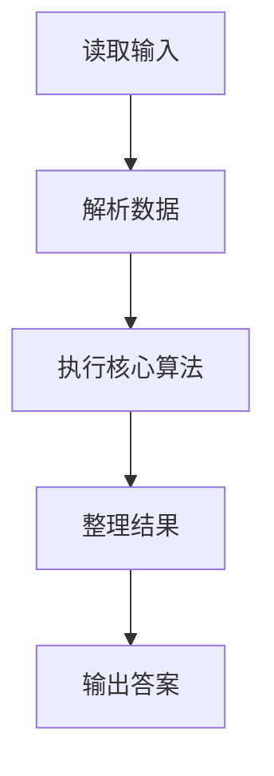
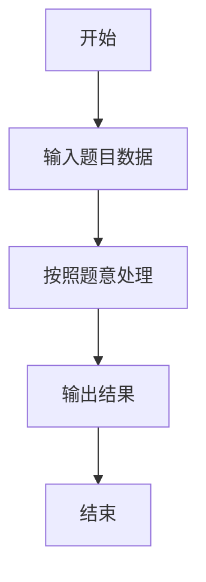

# L1-033 - 出生年（15 分）

- **时间限制**: 400 ms
- **内存限制**: 65536 KB
- **代码长度限制**: 16 KB

---

## 题目描述


以上是新浪微博中一奇葩贴：“我出生于1988年，直到25岁才遇到4个数字都不相同的年份。”也就是说，直到2013年才达到“4个数字都不相同”的要求。本题请你根据要求，自动填充“我出生于`y`年，直到`x`岁才遇到`n`个数字都不相同的年份”这句话。

### 输入格式:

输入在一行中给出出生年份`y`和目标年份中不同数字的个数`n`，其中`y`在[1, 3000]之间，`n`可以是2、或3、或4。注意不足4位的年份要在前面补零，例如公元1年被认为是0001年，有2个不同的数字0和1。

### 输出格式:

根据输入，输出`x`和能达到要求的年份。数字间以1个空格分隔，行首尾不得有多余空格。年份要按4位输出。注意：所谓“`n`个数字都不相同”是指不同的数字正好是`n`个。如“2013”被视为满足“4位数字都不同”的条件，但不被视为满足2位或3位数字不同的条件。

### 输入样例 1：
```in
1988 4
```

### 输出样例 1：
```out
25 2013
```

### 输入样例 2：
```in
1 2
```

### 输出样例 2：
```out
0 0001
```

## 示例

### 示例 1

**输入:**
```
1988 4
```

**输出:**
```
25 2013
```

### 示例 2

**输入:**
```
1 2
```

**输出:**
```
0 0001
```

### 解题思路

本题的 Ruby 实现采用字符串解析与规则处理。程序先读取题目输入，建立与题意对应的数据结构，按照约束完成核心计算，并按规定格式输出结果。具体实现以同目录的 main.rb 为准。

### 代码流程说明

1. 读取并解析标准输入，转换为题目所需的数据结构。
2. 按题意执行核心算法，维护中间状态并处理边界情况。
3. 整理计算结果，按照输出格式生成答案。

### 代码实现

完整实现位于同目录的 [main.rb](./L1-033_出生年/main.rb)，以下代码与该入口文件保持一致。

```ruby
# frozen_string_literal: true
require_relative '../gplt_runtime'
def entry
  birth, target = py_map(->(x) { py_int(x) }, py_tokens)
  for y in py_range(birth, 10000)
    s = "%04d" % [y]
    if ((py_len(Set.new(s)) == target))
      py_print((y - birth), s, sep: " ", ending: "\n")
      break
    end
  end
end
entry
```

### 代码流程图



### 解题流程图


