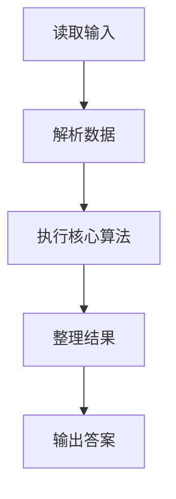
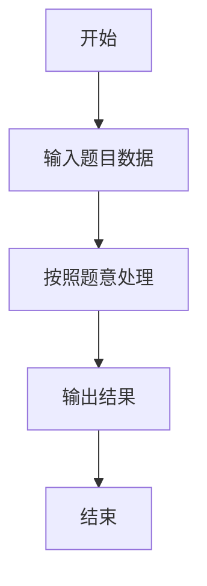

# L1-034 - 点赞（20 分）

- **时间限制**: 200 ms
- **内存限制**: 65536 KB
- **代码长度限制**: 16 KB

---

## 题目描述


微博上有个“点赞”功能，你可以为你喜欢的博文点个赞表示支持。每篇博文都有一些刻画其特性的标签，而你点赞的博文的类型，也间接刻画了你的特性。本题就要求你写个程序，通过统计一个人点赞的纪录，分析这个人的特性。

### 输入格式:

输入在第一行给出一个正整数$$N$$（$$\le 1000$$），是该用户点赞的博文数量。随后$$N$$行，每行给出一篇被其点赞的博文的特性描述，格式为“$$K$$ $$F_1\cdots F_K$$”，其中$$1\le K\le 10$$，$$F_i$$（$$i=1, \cdots , K$$）是特性标签的编号，我们将所有特性标签从1到1000编号。数字间以空格分隔。

### 输出格式:

统计所有被点赞的博文中最常出现的那个特性标签，在一行中输出它的编号和出现次数，数字间隔1个空格。如果有并列，则输出编号最大的那个。

### 输入样例:
```in
4
3 889 233 2
5 100 3 233 2 73
4 3 73 889 2
2 233 123
```

### 输出样例:
```out
233 3
```

## 示例

### 示例 1

**输入:**
```
4
3 889 233 2
5 100 3 233 2 73
4 3 73 889 2
2 233 123
```

**输出:**
```
233 3
```

### 解题思路

本题的 Ruby 实现采用字符串解析与规则处理。程序先读取题目输入，建立与题意对应的数据结构，按照约束完成核心计算，并按规定格式输出结果。具体实现以同目录的 main.rb 为准。

### 代码流程说明

1. 读取并解析标准输入，转换为题目所需的数据结构。
2. 按题意执行核心算法，维护中间状态并处理边界情况。
3. 整理计算结果，按照输出格式生成答案。

### 代码实现

完整实现位于同目录的 [main.rb](./main.rb)，以下代码与该入口文件保持一致。

```ruby
# frozen_string_literal: true
require_relative '../gplt_runtime'
def entry
  it = py_iter(py_map(->(x) { py_int(x) }, py_tokens))
  c = py_counter([])
  for _ in py_range(py_next(it))
    for _ in py_range(py_next(it))
      c[py_next(it)] += 1
    end
  end
  m = py_max(c.values(), default: 0)
  py_print(py_max(py_iterable(c.items()).flat_map { |__item_0|; k, v = __item_0; next [] unless py_truth(((v == m))); [k] }), m, sep: " ", ending: "\n")
end
entry
```

### 代码流程图



### 解题流程图


