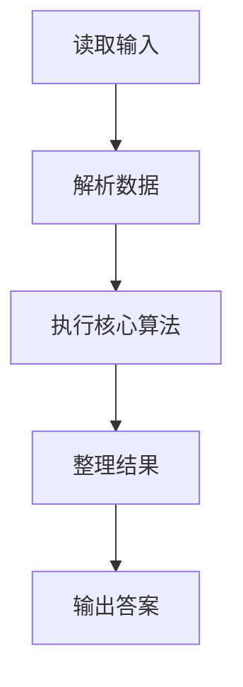
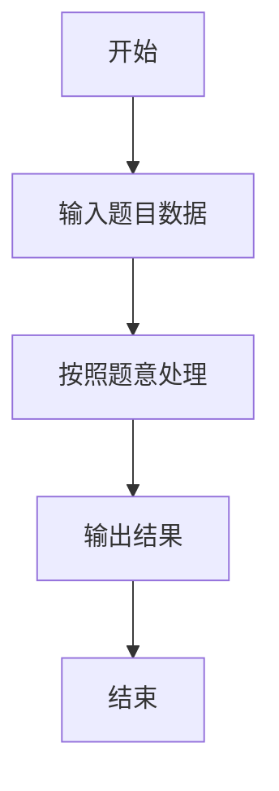

# L1-041 - 寻找250（10 分）

- **时间限制**: 400 ms
- **内存限制**: 65536 KB
- **代码长度限制**: 16 KB

---

## 题目描述


对方不想和你说话，并向你扔了一串数…… 而你必须从这一串数字中找到“250”这个高大上的感人数字。

### 输入格式:

输入在一行中给出不知道多少个绝对值不超过1000的整数，其中保证至少存在一个“250”。

### 输出格式:

在一行中输出第一次出现的“250”是对方扔过来的第几个数字（计数从1开始）。题目保证输出的数字在整型范围内。

### 输入样例:
```in
888 666 123 -233 250 13 250 -222
```

### 输出样例:
```out
5
```

## 示例

### 示例 1

**输入:**
```
888 666 123 -233 250 13 250 -222
```

**输出:**
```
5
```

### 解题思路

本题的 Ruby 实现采用字符串解析与规则处理。程序先读取题目输入，建立与题意对应的数据结构，按照约束完成核心计算，并按规定格式输出结果。具体实现以同目录的 main.rb 为准。

### 代码流程说明

1. 读取并解析标准输入，转换为题目所需的数据结构。
2. 按题意执行核心算法，维护中间状态并处理边界情况。
3. 整理计算结果，按照输出格式生成答案。

### 代码实现

完整实现位于同目录的 [main.rb](./main.rb)，以下代码与该入口文件保持一致。

```ruby
# frozen_string_literal: true
require_relative '../gplt_runtime'
def entry
  for i, x in py_enumerate(py_map(->(x) { py_int(x) }, py_tokens), 1)
    if ((x == 250))
      py_print(i, sep: " ", ending: "\n")
      break
    end
  end
end
entry
```

### 代码流程图



### 解题流程图


