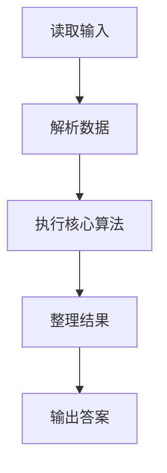
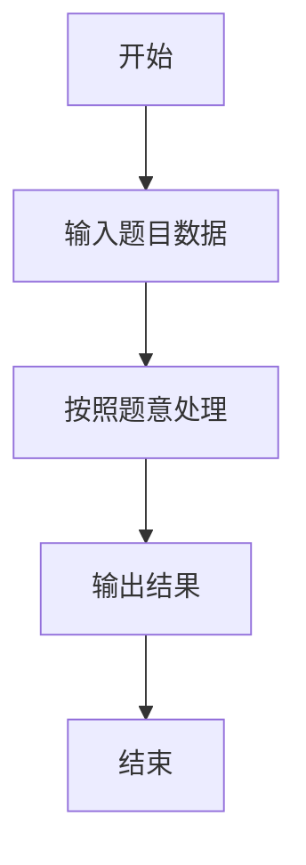

# L1-042 - 日期格式化（5 分）

- **时间限制**: 400 ms
- **内存限制**: 65536 KB
- **代码长度限制**: 16 KB

---

## 题目描述


世界上不同国家有不同的写日期的习惯。比如美国人习惯写成“月-日-年”，而中国人习惯写成“年-月-日”。下面请你写个程序，自动把读入的美国格式的日期改写成中国习惯的日期。

### 输入格式:

输入在一行中按照“mm-dd-yyyy”的格式给出月、日、年。题目保证给出的日期是1900年元旦至今合法的日期。

### 输出格式:

在一行中按照“yyyy-mm-dd”的格式给出年、月、日。

### 输入样例:
```in
03-15-2017
```

### 输出样例:
```out
2017-03-15
```

## 示例

### 示例 1

**输入:**
```
03-15-2017
```

**输出:**
```
2017-03-15
```

### 解题思路

本题的 Ruby 实现采用字符串解析与规则处理。程序先读取题目输入，建立与题意对应的数据结构，按照约束完成核心计算，并按规定格式输出结果。具体实现以同目录的 main.rb 为准。

### 代码流程说明

1. 读取并解析标准输入，转换为题目所需的数据结构。
2. 按题意执行核心算法，维护中间状态并处理边界情况。
3. 整理计算结果，按照输出格式生成答案。

### 代码实现

完整实现位于同目录的 [main.rb](./L1-042_日期格式化/main.rb)，以下代码与该入口文件保持一致。

```ruby
# frozen_string_literal: true
require_relative '../gplt_runtime'
def entry
  m, d, y = py_tokens[0].split("-")
  py_print("%s-%s-%s" % [y, m, d], sep: " ", ending: "\n")
end
entry
```

### 代码流程图



### 解题流程图


