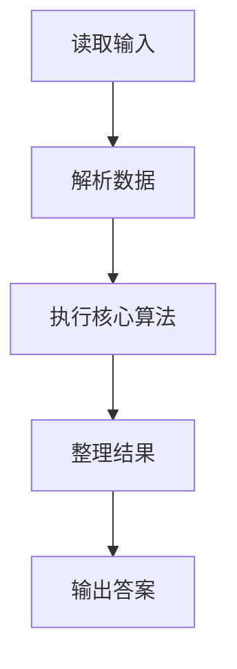
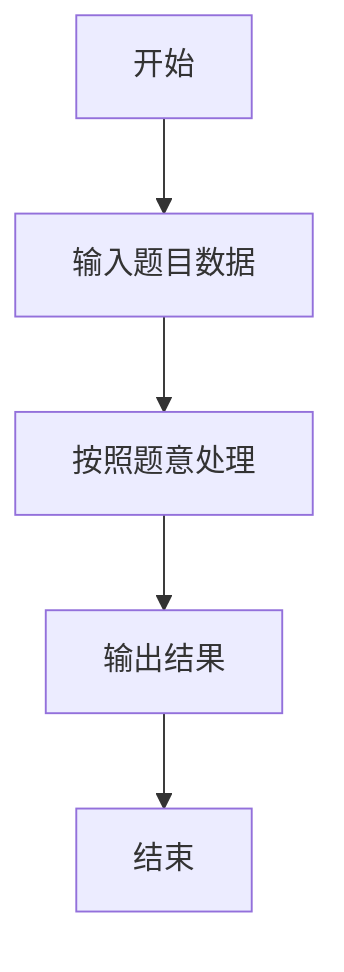

# L1-049 - 天梯赛座位分配（20 分）

- **时间限制**: 400 ms
- **内存限制**: 65536 KB
- **代码长度限制**: 16 KB

---

## 题目描述


天梯赛每年有大量参赛队员，要保证同一所学校的所有队员都不能相邻，分配座位就成为一件比较麻烦的事情。为此我们制定如下策略：假设某赛场有 N 所学校参赛，第 i 所学校有 M[i] 支队伍，每队 10 位参赛选手。令每校选手排成一列纵队，第 i+1 队的选手排在第 i 队选手之后。从第 1 所学校开始，各校的第 1 位队员顺次入座，然后是各校的第 2 位队员…… 以此类推。如果最后只剩下 1 所学校的队伍还没有分配座位，则需要安排他们的队员隔位就坐。本题就要求你编写程序，自动为各校生成队员的座位号，从 1 开始编号。

### 输入格式:

输入在一行中给出参赛的高校数 N （不超过100的正整数）；第二行给出 N 个不超过10的正整数，其中第 i 个数对应第 i 所高校的参赛队伍数，数字间以空格分隔。

### 输出格式:

从第 1 所高校的第 1 支队伍开始，顺次输出队员的座位号。每队占一行，座位号间以 1 个空格分隔，行首尾不得有多余空格。另外，每所高校的第一行按“#X”输出该校的编号X，从 1 开始。

### 输入样例:
```in
3
3 4 2
```

### 输出样例:
```out
#1
1 4 7 10 13 16 19 22 25 28
31 34 37 40 43 46 49 52 55 58
61 63 65 67 69 71 73 75 77 79
#2
2 5 8 11 14 17 20 23 26 29
32 35 38 41 44 47 50 53 56 59
62 64 66 68 70 72 74 76 78 80
82 84 86 88 90 92 94 96 98 100
#3
3 6 9 12 15 18 21 24 27 30
33 36 39 42 45 48 51 54 57 60
```

## 示例

### 示例 1

**输入:**
```
3
3 4 2
```

**输出:**
```
#1
1 4 7 10 13 16 19 22 25 28
31 34 37 40 43 46 49 52 55 58
61 63 65 67 69 71 73 75 77 79
#2
2 5 8 11 14 17 20 23 26 29
32 35 38 41 44 47 50 53 56 59
62 64 66 68 70 72 74 76 78 80
82 84 86 88 90 92 94 96 98 100
#3
3 6 9 12 15 18 21 24 27 30
33 36 39 42 45 48 51 54 57 60
```

### 解题思路

本题的 Ruby 实现采用字符串解析与规则处理。程序先读取题目输入，建立与题意对应的数据结构，按照约束完成核心计算，并按规定格式输出结果。具体实现以同目录的 main.rb 为准。

### 代码流程说明

1. 读取并解析标准输入，转换为题目所需的数据结构。
2. 按题意执行核心算法，维护中间状态并处理边界情况。
3. 整理计算结果，按照输出格式生成答案。

### 代码实现

完整实现位于同目录的 [main.rb](./L1-049_天梯赛座位分配/main.rb)，以下代码与该入口文件保持一致。

```ruby
# frozen_string_literal: true
require_relative '../gplt_runtime'
def entry
  it = py_iter(py_map(->(x) { py_int(x) }, py_tokens))
  n = py_next(it)
  total = py_iterable(py_range(n)).flat_map { |_|; [(py_next(it) * 10)] }
  got = py_iterable(py_range(n)).flat_map { |_|; [[]] }
  p = ([0] * n)
  seat = 1
  last = (-1)
  while ((py_sum(py_iterable(py_range(n)).flat_map { |i|; [((p[i] < total[i]))] }) > 1))
    for i in py_range(n)
      if ((p[i] < total[i]))
        got[i].append(seat)
        p[i] += 1
        seat += 1
        last = i
      end
    end
  end
  left = py_next(py_iterable(py_range(n)).flat_map { |i|; next [] unless py_truth(((p[i] < total[i]))); [i] })
  if ((left >= 0))
    if ((last == left))
      seat += 1
    end
    while ((p[left] < total[left]))
      got[left].append(seat)
      p[left] += 1
      seat += 2
    end
  end
  out = []
  for i, arr in py_enumerate(got)
    out.append("#%s" % [(i + 1)])
    for j in py_range(0, py_len(arr), 10)
      out.append(py_map(->(x) { py_str(x) }, py_slice(arr, j, (j + 10), nil)).join(" "))
    end
  end
  py_print(out.join("\n"), sep: " ", ending: "\n")
end
entry
```

### 代码流程图



### 解题流程图


