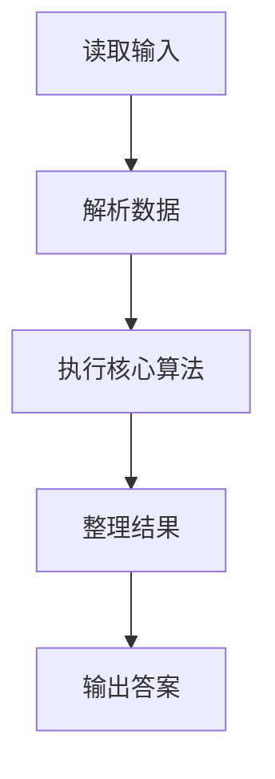
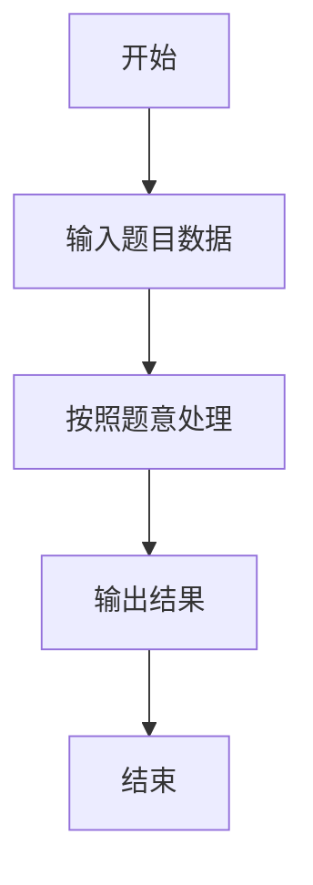

# L1-051 - 打折（5 分）

- **时间限制**: 400 ms
- **内存限制**: 65536 KB
- **代码长度限制**: 16 KB

---

## 题目描述


去商场淘打折商品时，计算打折以后的价钱是件颇费脑子的事情。例如原价 ￥988，标明打 7 折，则折扣价应该是 ￥988 x 70% = ￥691.60。本题就请你写个程序替客户计算折扣价。

### 输入格式:

输入在一行中给出商品的原价（不超过1万元的正整数）和折扣（为[1, 9]区间内的整数），其间以空格分隔。

### 输出格式:

在一行中输出商品的折扣价，保留小数点后 2 位。

### 输入样例:
```in
988 7
```

### 输出样例:
```out
691.60
```

## 示例

### 示例 1

**输入:**
```
988 7
```

**输出:**
```
691.60
```

### 解题思路

本题的 Ruby 实现采用字符串解析与规则处理。程序先读取题目输入，建立与题意对应的数据结构，按照约束完成核心计算，并按规定格式输出结果。具体实现以同目录的 main.rb 为准。

### 代码流程说明

1. 读取并解析标准输入，转换为题目所需的数据结构。
2. 按题意执行核心算法，维护中间状态并处理边界情况。
3. 整理计算结果，按照输出格式生成答案。

### 代码实现

完整实现位于同目录的 [main.rb](./L1-051_打折/main.rb)，以下代码与该入口文件保持一致。

```ruby
# frozen_string_literal: true
require_relative '../gplt_runtime'
def entry
  a, d = py_map(->(x) { py_int(x) }, py_tokens)
  py_print("%.2f" % [py_div((a * d), 10)], sep: " ", ending: "\n")
end
entry
```

### 代码流程图



### 解题流程图


