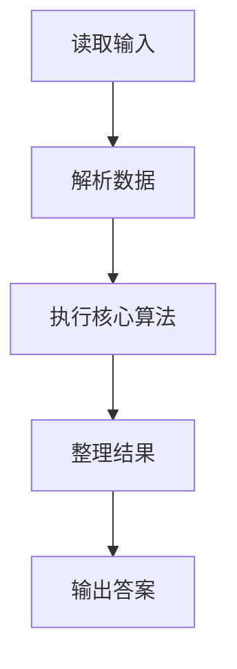
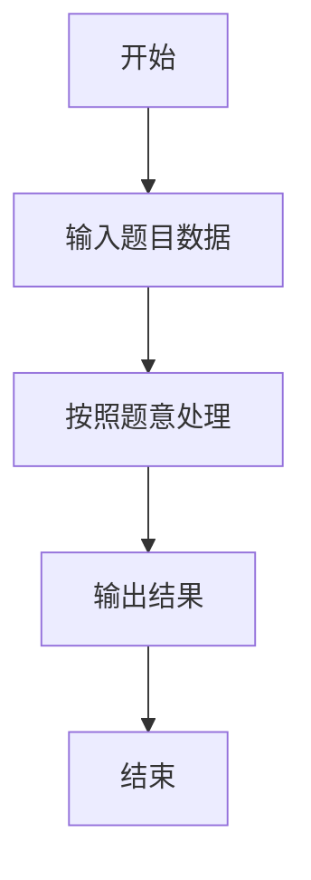

# L1-053 - 电子汪（10 分）

- **时间限制**: 400 ms
- **内存限制**: 65536 KB
- **代码长度限制**: 16 KB

---

## 题目描述


据说汪星人的智商能达到人类 4 岁儿童的水平，更有些聪明汪会做加法计算。比如你在地上放两堆小球，分别有 1 只球和 2 只球，聪明汪就会用“汪！汪！汪！”表示 1 加 2 的结果是 3。

本题要求你为电子宠物汪做一个模拟程序，根据电子眼识别出的两堆小球的个数，计算出和，并且用汪星人的叫声给出答案。

### 输入格式:

输入在一行中给出两个 [1, 9] 区间内的正整数 A 和 B，用空格分隔。

### 输出格式:

在一行中输出 A + B 个`Wang!`。

### 输入样例:
```in
2 1
```

### 输出样例:
```out
Wang!Wang!Wang!
```

## 示例

### 示例 1

**输入:**
```
2 1
```

**输出:**
```
Wang!Wang!Wang!
```

### 解题思路

本题的 Ruby 实现采用字符串解析与规则处理。程序先读取题目输入，建立与题意对应的数据结构，按照约束完成核心计算，并按规定格式输出结果。具体实现以同目录的 main.rb 为准。

### 代码流程说明

1. 读取并解析标准输入，转换为题目所需的数据结构。
2. 按题意执行核心算法，维护中间状态并处理边界情况。
3. 整理计算结果，按照输出格式生成答案。

### 代码实现

完整实现位于同目录的 [main.rb](./main.rb)，以下代码与该入口文件保持一致。

```ruby
# frozen_string_literal: true
require_relative '../gplt_runtime'
def entry
  a, b = py_map(->(x) { py_int(x) }, py_tokens)
  py_print(("Wang!" * (a + b)), sep: " ", ending: "\n")
end
entry
```

### 代码流程图



### 解题流程图


