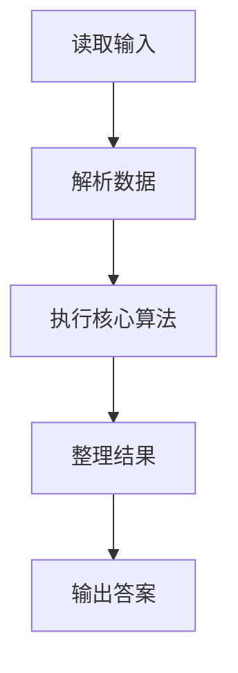
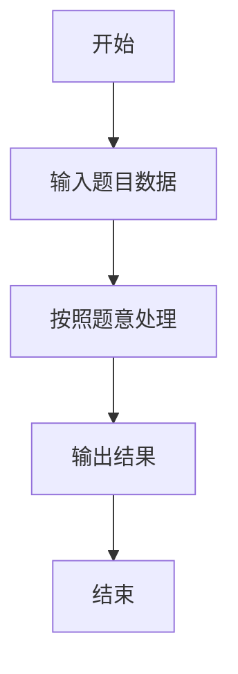

# L1-055 - 谁是赢家（10 分）

- **时间限制**: 400 ms
- **内存限制**: 65536 KB
- **代码长度限制**: 16 KB

---

## 题目描述


某电视台的娱乐节目有个表演评审环节，每次安排两位艺人表演，他们的胜负由观众投票和 3 名评委投票两部分共同决定。规则为：如果一位艺人的观众票数高，且得到至少 1 名评委的认可，该艺人就胜出；或艺人的观众票数低，但得到全部评委的认可，也可以胜出。节目保证投票的观众人数为奇数，所以不存在平票的情况。本题就请你用程序判断谁是赢家。

### 输入格式:

输入第一行给出 2 个不超过 1000 的正整数 Pa 和 Pb，分别是艺人 a 和艺人 b 得到的观众票数。题目保证这两个数字不相等。随后第二行给出 3 名评委的投票结果。数字 0 代表投票给 a，数字 1 代表投票给 b，其间以一个空格分隔。

### 输出格式:

按以下格式输出赢家：

```
The winner is x: P1 + P2
```

其中 `x` 是代表赢家的字母，`P1` 是赢家得到的观众票数，`P2` 是赢家得到的评委票数。

### 输入样例:
```in
327 129
1 0 1
```

### 输出样例:
```out
The winner is a: 327 + 1
```

## 示例

### 示例 1

**输入:**
```
327 129
1 0 1
```

**输出:**
```
The winner is a: 327 + 1
```

### 解题思路

本题的 Ruby 实现采用字符串解析与规则处理。程序先读取题目输入，建立与题意对应的数据结构，按照约束完成核心计算，并按规定格式输出结果。具体实现以同目录的 main.rb 为准。

### 代码流程说明

1. 读取并解析标准输入，转换为题目所需的数据结构。
2. 按题意执行核心算法，维护中间状态并处理边界情况。
3. 整理计算结果，按照输出格式生成答案。

### 代码实现

完整实现位于同目录的 [main.rb](./L1-055_谁是赢家/main.rb)，以下代码与该入口文件保持一致。

```ruby
# frozen_string_literal: true
require_relative '../gplt_runtime'
def entry
  a, b, *v = py_map(->(x) { py_int(x) }, py_tokens)
  x = v.count(0)
  y = (3 - x)
  if ((((a > b)) && ((x >= 1))) || (((a < b)) && ((x == 3))))
    py_print("The winner is a: %s + %s" % [a, x], sep: " ", ending: "\n")
    else
      py_print("The winner is b: %s + %s" % [b, y], sep: " ", ending: "\n")
  end
end
entry
```

### 代码流程图



### 解题流程图


