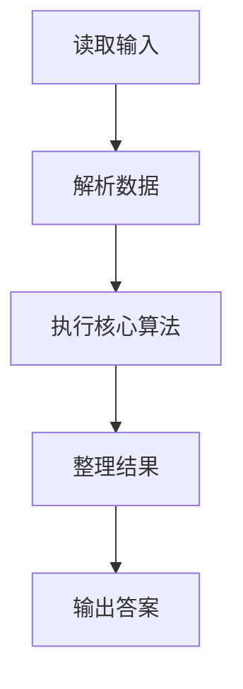
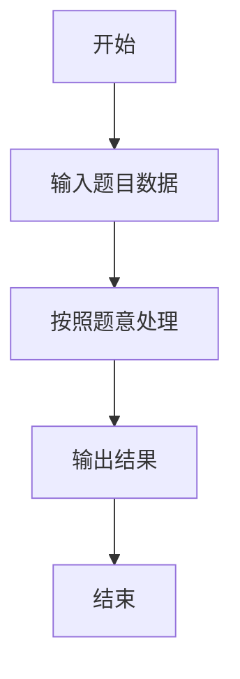

# L1-060 - 心理阴影面积（5 分）

- **时间限制**: 400 ms
- **内存限制**: 65536 KB
- **代码长度限制**: 16 KB

---

## 题目描述


这是一幅心理阴影面积图。我们都以为自己可以匀速前进（图中蓝色直线），而拖延症晚期的我们往往执行的是最后时刻的疯狂赶工（图中的红色折线）。由红、蓝线围出的面积，就是我们在做作业时的心理阴影面积。

现给出红色拐点的坐标 $$(x,y)$$，要求你算出这个心理阴影面积。

### 输入格式:

输入在一行中给出 2 个不超过 100 的正整数 $$x$$ 和 $$y$$，并且保证有 $$x>y$$。这里假设横、纵坐标的最大值（即截止日和最终完成度）都是 100。

### 输出格式:

在一行中输出心理阴影面积。

友情提醒：三角形的面积 = 底边长 x 高 / 2；矩形面积 = 底边长 x 高。嫑想得太复杂，这是一道 5 分考减法的题……

### 输入样例:
```in
90 10
```

### 输出样例:
```out
4000
```

## 示例

### 示例 1

**输入:**
```
90 10
```

**输出:**
```
4000
```

### 解题思路

本题的 Ruby 实现采用字符串解析与规则处理。程序先读取题目输入，建立与题意对应的数据结构，按照约束完成核心计算，并按规定格式输出结果。具体实现以同目录的 main.rb 为准。

### 代码流程说明

1. 读取并解析标准输入，转换为题目所需的数据结构。
2. 按题意执行核心算法，维护中间状态并处理边界情况。
3. 整理计算结果，按照输出格式生成答案。

### 代码实现

完整实现位于同目录的 [main.rb](./main.rb)，以下代码与该入口文件保持一致。

```ruby
# frozen_string_literal: true
require_relative '../gplt_runtime'
def entry
  x, y = py_map(->(x) { py_int(x) }, py_tokens)
  py_print((50 * (x - y)), sep: " ", ending: "\n")
end
entry
```

### 代码流程图



### 解题流程图


