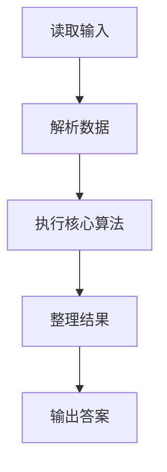
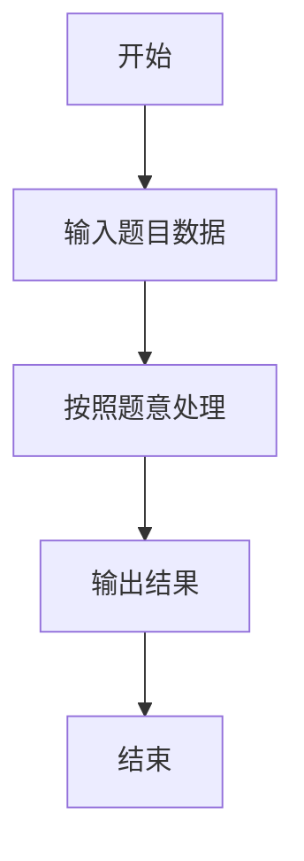

# L1-067 -  洛希极限（10 分）

- **时间限制**: 400 ms
- **内存限制**: 65536 KB
- **代码长度限制**: 16 KB

---

## 题目描述


科幻电影《流浪地球》中一个重要的情节是地球距离木星太近时，大气开始被木星吸走，而随着不断接近地木“刚体洛希极限”，地球面临被彻底撕碎的危险。但实际上，这个计算是错误的。


洛希极限（Roche limit）是一个天体自身的引力与第二个天体造成的潮汐力相等时的距离。当两个天体的距离少于洛希极限，天体就会倾向碎散，继而成为第二个天体的环。它以首位计算这个极限的人爱德华·洛希命名。（摘自百度百科）

大天体密度与小天体的密度的比值开 3 次方后，再乘以大天体的半径以及一个倍数（流体对应的倍数是 2.455，刚体对应的倍数是 1.26），就是洛希极限的值。例如木星与地球的密度比值开 3 次方是 0.622，如果假设地球是流体，那么洛希极限就是 $$0.622\times 2.455=1.52701$$ 倍木星半径；但地球是刚体，对应的洛希极限是 $$0.622\times 1.26=0.78372$$ 倍木星半径，这个距离比木星半径小，即只有当地球位于木星内部的时候才会被撕碎，换言之，就是地球不可能被撕碎。

本题就请你判断一个小天体会不会被一个大天体撕碎。

### 输入格式:

输入在一行中给出 3 个数字，依次为：大天体密度与小天体的密度的比值开 3 次方后计算出的值（$$\le 1$$）、小天体的属性（0 表示流体、1 表示刚体）、两个天体的距离与大天体半径的比值（$$>1$$ 但不超过 10）。

### 输出格式:

在一行中首先输出小天体的洛希极限与大天体半径的比值（输出小数点后2位）；随后空一格；最后输出 `^_^` 如果小天体不会被撕碎，否则输出 `T_T`。

### 输入样例 1：
```in
0.622 0 1.4
```

### 输出样例 1：
```out
1.53 T_T
```

### 输入样例 2：
```in
0.622 1 1.4
```

### 输出样例 2：
```out
0.78 ^_^
```

## 示例

### 示例 1

**输入:**
```
0.622 0 1.4
```

**输出:**
```
1.53 T_T
```

### 示例 2

**输入:**
```
0.622 1 1.4
```

**输出:**
```
0.78 ^_^
```

### 解题思路

本题的 Ruby 实现采用字符串解析与规则处理。程序先读取题目输入，建立与题意对应的数据结构，按照约束完成核心计算，并按规定格式输出结果。具体实现以同目录的 main.rb 为准。

### 代码流程说明

1. 读取并解析标准输入，转换为题目所需的数据结构。
2. 按题意执行核心算法，维护中间状态并处理边界情况。
3. 整理计算结果，按照输出格式生成答案。

### 代码实现

完整实现位于同目录的 [main.rb](./L1-067_洛希极限/main.rb)，以下代码与该入口文件保持一致。

```ruby
# frozen_string_literal: true
require_relative '../gplt_runtime'
def entry
  r, t, d = py_map(->(x) { py_float(x) }, py_tokens)
  lim = (r * (((t == 0)) ? 2.455 : 1.26))
  py_print(("%.2f " % [lim] + (((d < lim)) ? "T_T" : "^_^")), sep: " ", ending: "\n")
end
entry
```

### 代码流程图



### 解题流程图


