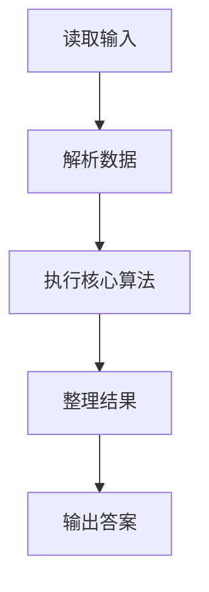
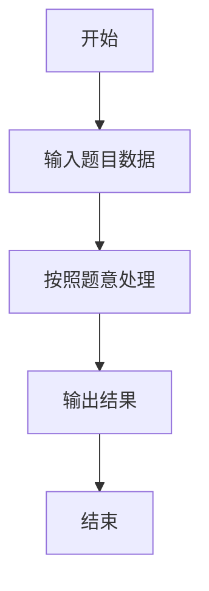

# L1-069 - 胎压监测（15 分）

- **时间限制**: 400 ms
- **内存限制**: 65536 KB
- **代码长度限制**: 16 KB

---

## 题目描述


小轿车中有一个系统随时监测四个车轮的胎压，如果四轮胎压不是很平衡，则可能对行车造成严重的影响。


让我们把四个车轮 —— 左前轮、右前轮、右后轮、左后轮 —— 顺次编号为 1、2、3、4。本题就请你编写一个监测程序，随时监测四轮的胎压，并给出正确的报警信息。报警规则如下：

- 如果所有轮胎的压力值与它们中的最大值误差在一个给定阈值内，并且都不低于系统设定的最低报警胎压，则说明情况正常，不报警；
- 如果存在一个轮胎的压力值与它们中的最大值误差超过了阈值，或者低于系统设定的最低报警胎压，则不仅要报警，而且要给出可能漏气的轮胎的准确位置；
- 如果存在两个或两个以上轮胎的压力值与它们中的最大值误差超过了阈值，或者低于系统设定的最低报警胎压，则报警要求检查所有轮胎。

### 输入格式:

输入在一行中给出 6 个 [0, 400] 范围内的整数，依次为 1~4 号轮胎的胎压、最低报警胎压、以及胎压差的阈值。

### 输出格式:

根据输入的胎压值给出对应信息：

- 如果不用报警，输出 `Normal`；
- 如果有一个轮胎需要报警，输出 `Warning: please check #X!`，其中 `X` 是出问题的轮胎的编号；
- 如果需要检查所有轮胎，输出 `Warning: please check all the tires!`。

### 输入样例 1：
```in
242 251 231 248 230 20
```

### 输出样例 1：
```out
Normal
```

### 输入样例 2：
```in
242 251 232 248 230 10
```

### 输出样例 2：
```out
Warning: please check #3!
```

### 输入样例 3：
```in
240 251 232 248 240 10
```

### 输出样例 3：
```out
Warning: please check all the tires!
```

## 示例

### 示例 1

**输入:**
```
242 251 231 248 230 20
```

**输出:**
```
Normal
```

### 示例 2

**输入:**
```
242 251 232 248 230 10
```

**输出:**
```
Warning: please check #3!
```

### 示例 3

**输入:**
```
240 251 232 248 240 10
```

**输出:**
```
Warning: please check all the tires!
```

### 解题思路

本题的 Ruby 实现采用字符串解析与规则处理。程序先读取题目输入，建立与题意对应的数据结构，按照约束完成核心计算，并按规定格式输出结果。具体实现以同目录的 main.rb 为准。

### 代码流程说明

1. 读取并解析标准输入，转换为题目所需的数据结构。
2. 按题意执行核心算法，维护中间状态并处理边界情况。
3. 整理计算结果，按照输出格式生成答案。

### 代码实现

完整实现位于同目录的 [main.rb](./main.rb)，以下代码与该入口文件保持一致。

```ruby
# frozen_string_literal: true
require_relative '../gplt_runtime'
def entry
  v = (py_map(->(x) { py_int(x) }, py_tokens).to_a)
  p = py_slice(v, nil, 4, nil)
  low, th = py_slice(v, 4, nil, nil)
  mx = py_max(p)
  bad = py_iterable(py_enumerate(p)).flat_map { |__item_0|; i, x = __item_0; next [] unless py_truth((((x < low)) || (((mx - x) > th)))); [i] }
  py_print(((!py_truth(bad)) ? "Normal" : (((py_len(bad) == 1)) ? "Warning: please check #%s!" % [(bad[0] + 1)] : "Warning: please check all the tires!")), sep: " ", ending: "\n")
end
entry
```

### 代码流程图



### 解题流程图


