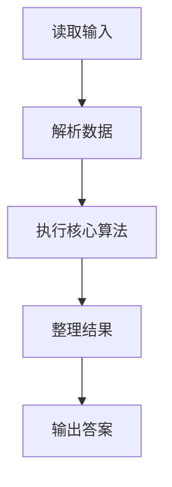
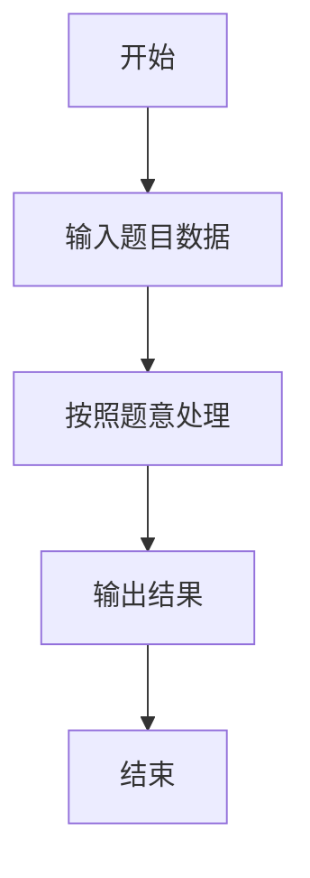

# L1-070 - 吃火锅（15 分）

- **时间限制**: 400 ms
- **内存限制**: 65536 KB
- **代码长度限制**: 16 KB

---

## 题目描述


以上图片来自微信朋友圈：这种天气你有什么破事打电话给我基本没用。但是如果你说“吃火锅”，那就厉害了，我们的故事就开始了。

本题要求你实现一个程序，自动检查你朋友给你发来的信息里有没有 `chi1 huo3 guo1`。

### 输入格式:

输入每行给出一句不超过 80 个字符的、以回车结尾的朋友信息，信息为非空字符串，仅包括字母、数字、空格、可见的半角标点符号。当读到某一行只有一个英文句点 `.` 时，输入结束，此行不算在朋友信息里。

### 输出格式:

首先在一行中输出朋友信息的总条数。然后对朋友的每一行信息，检查其中是否包含 `chi1 huo3 guo1`，并且统计这样厉害的信息有多少条。在第二行中首先输出第一次出现 `chi1 huo3 guo1` 的信息是第几条（从 1 开始计数），然后输出这类信息的总条数，其间以一个空格分隔。题目保证输出的所有数字不超过 100。

如果朋友从头到尾都没提 `chi1 huo3 guo1` 这个关键词，则在第二行输出一个表情 `-_-#`。

### 输入样例 1：
```in
Hello!
are you there?
wantta chi1 huo3 guo1?
that's so li hai le
our story begins from chi1 huo3 guo1 le
.
```

### 输出样例 1：
```out
5
3 2
```

### 输入样例 2：
```in
Hello!
are you there?
wantta qi huo3 guo1 chi1huo3guo1?
that's so li hai le
our story begins from ci1 huo4 guo2 le
.
```

### 输出样例 2：
```out
5
-_-#
```

## 示例

### 示例 1

**输入:**
```
Hello!
are you there?
wantta chi1 huo3 guo1?
that's so li hai le
our story begins from chi1 huo3 guo1 le
.
```

**输出:**
```
5
3 2
```

### 示例 2

**输入:**
```
Hello!
are you there?
wantta qi huo3 guo1 chi1huo3guo1?
that's so li hai le
our story begins from ci1 huo4 guo2 le
.
```

**输出:**
```
5
-_-#
```

### 解题思路

本题的 Ruby 实现采用字符串解析与规则处理。程序先读取题目输入，建立与题意对应的数据结构，按照约束完成核心计算，并按规定格式输出结果。具体实现以同目录的 main.rb 为准。

### 代码流程说明

1. 读取并解析标准输入，转换为题目所需的数据结构。
2. 按题意执行核心算法，维护中间状态并处理边界情况。
3. 整理计算结果，按照输出格式生成答案。

### 代码实现

完整实现位于同目录的 [main.rb](./main.rb)，以下代码与该入口文件保持一致。

```ruby
# frozen_string_literal: true
require_relative '../gplt_runtime'
def entry
  a = py_lines
  a = ((py_in(".", a)) ? py_slice(a, nil, a.index("."), nil) : a)
  hit = py_iterable(py_enumerate(a)).flat_map { |__item_0|; i, s = __item_0; next [] unless py_truth((py_in("chi1 huo3 guo1", s))); [(i + 1)] }
  py_print(py_len(a), sep: " ", ending: "\n")
  py_print((py_truth(hit) ? "%s %s" % [hit[0], py_len(hit)] : "-_-#"), sep: " ", ending: "\n")
end
entry
```

### 代码流程图



### 解题流程图


