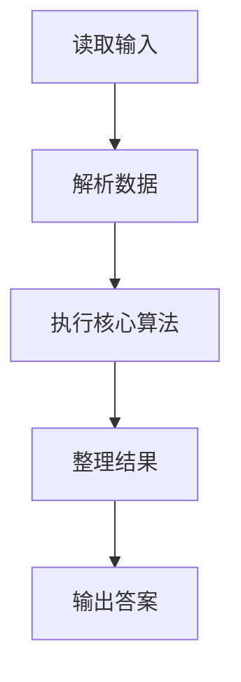
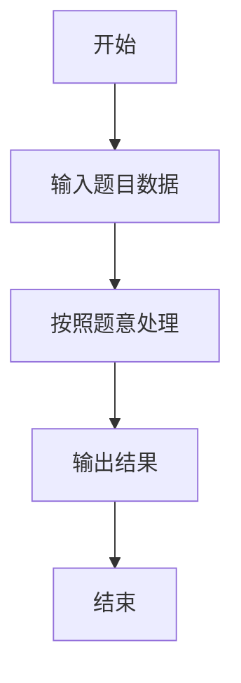

# L1-072 - 刮刮彩票（20 分）

- **时间限制**: 400 ms
- **内存限制**: 65536 KB
- **代码长度限制**: 16 KB

---

## 题目描述


“刮刮彩票”是一款网络游戏里面的一个小游戏。如图所示：


每次游戏玩家会拿到一张彩票，上面会有 9 个数字，分别为数字 1 到数字 9，数字各不重复，并以 $$3\times3$$ 的“九宫格”形式排布在彩票上。

在游戏开始时能看见一个位置上的数字，其他位置上的数字均不可见。你可以选择三个位置的数字刮开，这样玩家就能看见四个位置上的数字了。最后玩家再从 3 横、3 竖、2 斜共 8 个方向中挑选一个方向，方向上三个数字的和可根据下列表格进行兑奖，获得对应数额的金币。


| 数字合计 | 获得金币 | 数字合计 | 获得金币 |
| -------- | -------- | -------- | -------- |
| 6     | 10,000     | 16     | 72     |
| 7     | 36     | 17     | 180     |
| 8     | 720     | 18     | 119     |
| 9     | 360     | 19     | 36     |
| 10     | 80     | 20     | 306     |
| 11    | 252     | 21     | 1,080     |
| 12    | 108     | 22    | 144     |
| 13    | 72     | 23    | 1,800     |
| 14    | 54     | 24    | 3,600     |
| 15    | 180     |      ||      |


现在请你写出一个模拟程序，模拟玩家的游戏过程。

### 输入格式:

输入第一部分给出一张合法的彩票，即用 3 行 3 列给出 0 至 9 的数字。**0 表示的是这个位置上的数字初始时就能看见了**，而不是彩票上的数字为 0。

第二部给出玩家刮开的三个位置，分为三行，每行按格式 `x y` 给出玩家刮开的位置的行号和列号（题目中定义左上角的位置为第 1 行、第 1 列。）。数据保证玩家不会重复刮开已刮开的数字。

最后一部分给出玩家选择的方向，即一个整数： 1 至 3 表示选择横向的第一行、第二行、第三行，4 至 6 表示纵向的第一列、第二列、第三列，7、8分别表示左上到右下的主对角线和右上到左下的副对角线。

### 输出格式:

对于每一个刮开的操作，在一行中输出玩家能看到的数字。最后对于选择的方向，在一行中输出玩家获得的金币数量。

### 输入样例:
```in
1 2 3
4 5 6
7 8 0
1 1
2 2
2 3
7
```

### 输出样例:
```out
1
5
6
180
```

## 示例

### 示例 1

**输入:**
```
1 2 3
4 5 6
7 8 0
1 1
2 2
2 3
7
```

**输出:**
```
1
5
6
180
```

### 解题思路

本题的 Ruby 实现采用字符串解析与规则处理。程序先读取题目输入，建立与题意对应的数据结构，按照约束完成核心计算，并按规定格式输出结果。具体实现以同目录的 main.rb 为准。

### 代码流程说明

1. 读取并解析标准输入，转换为题目所需的数据结构。
2. 按题意执行核心算法，维护中间状态并处理边界情况。
3. 整理计算结果，按照输出格式生成答案。

### 代码实现

完整实现位于同目录的 [main.rb](./L1-072_刮刮彩票/main.rb)，以下代码与该入口文件保持一致。

```ruby
# frozen_string_literal: true
require_relative '../gplt_runtime'
def entry
  v = (py_map(->(x) { py_int(x) }, py_tokens).to_a)
  a = py_iterable(py_range(3)).flat_map { |i|; [py_slice(v, (i * 3), ((i * 3) + 3), nil)] }
  missing = (Set.new([1, 2, 3, 4, 5, 6, 7, 8, 9]) - Set.new(py_slice(v, nil, 9, nil))).pop()
  for i in py_range(3)
    for j in py_range(3)
      if ((a[i][j] == 0))
        a[i][j] = missing
      end
    end
  end
  k = 9
  for _ in py_range(3)
    py_print(a[(v[k] - 1)][(v[(k + 1)] - 1)], sep: " ", ending: "\n")
    k += 2
  end
  d = v[k]
  if ((d <= 3))
    sm = py_sum(a[(d - 1)])
    else
      if ((d <= 6))
        sm = py_sum(py_iterable(py_range(3)).flat_map { |i|; [a[i][(d - 4)]] })
        else
          if ((d == 7))
            sm = py_sum(py_iterable(py_range(3)).flat_map { |i|; [a[i][i]] })
            else
              sm = py_sum(py_iterable(py_range(3)).flat_map { |i|; [a[i][(2 - i)]] })
          end
      end
  end
  pr = [0, 0, 0, 0, 0, 0, 10000, 36, 720, 360, 80, 252, 108, 72, 54, 180, 72, 180, 119, 36, 306, 1080, 144, 1800, 3600]
  py_print(pr[sm], sep: " ", ending: "\n")
end
entry
```

### 代码流程图



### 解题流程图


