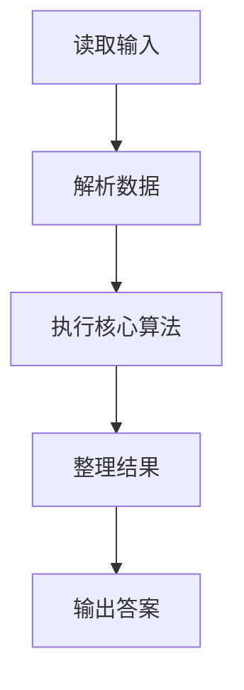
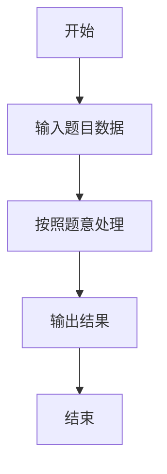

# L1-078 - 吉老师的回归（15 分）

- **时间限制**: 400 ms
- **内存限制**: 65536 KB
- **代码长度限制**: 16 KB

---

## 题目描述


曾经在天梯赛大杀四方的吉老师决定回归天梯赛赛场啦！

为了简化题目，我们不妨假设天梯赛的每道题目可以用一个不超过 500 的、只包括可打印符号的字符串描述出来，如：`Problem A: Print "Hello world!"`。

众所周知，吉老师的竞赛水平非常高超，你可以认为他每道题目都会做（事实上也是……）。因此，吉老师会按照顺序看题并做题。但吉老师水平太高了，所以签到题他就懒得做了（浪费时间），具体来说，假如题目的字符串里有 `qiandao` 或者 `easy`（区分大小写）的话，吉老师看完题目就会跳过这道题目不做。

现在给定这次天梯赛总共有几道题目以及吉老师已经做完了几道题目，请你告诉大家吉老师现在正在做哪个题，或者吉老师已经把所有他打算做的题目做完了。

*提醒：天梯赛有分数升级的规则，如果不做签到题可能导致团队总分不足以升级，一般的选手请千万不要学习吉老师的酷炫行为！*

### 输入格式:

输入第一行是两个正整数 $$N, M$$ ($$1 \le M\le N \le 30$$)，表示本次天梯赛有 $$N$$ 道题目，吉老师现在做完了 $$M$$ 道。

接下来 $$N$$ 行，每行是一个符合题目描述的字符串，表示天梯赛的题目内容。吉老师会按照给出的顺序看题——第一行就是吉老师看的第一道题，第二行就是第二道，以此类推。

### 输出格式:

在一行中输出吉老师当前正在做的题目对应的题面（即做完了 $$M$$ 道题目后，吉老师正在做哪个题）。如果吉老师已经把所有他打算做的题目做完了，输出一行 `Wo AK le`。

### 输入样例 1：
```in
5 1
L1-1 is a qiandao problem.
L1-2 is so...easy.
L1-3 is Easy.
L1-4 is qianDao.
Wow, such L1-5, so easy.
```

### 输出样例 1：
```out
L1-4 is qianDao.
```

### 输入样例 2：
```in
5 4
L1-1 is a-qiandao problem.
L1-2 is so easy.
L1-3 is Easy.
L1-4 is qianDao.
Wow, such L1-5, so!!easy.
```

### 输出样例 2：
```out
Wo AK le
```

## 示例

### 示例 1

**输入:**
```
5 1
L1-1 is a qiandao problem.
L1-2 is so...easy.
L1-3 is Easy.
L1-4 is qianDao.
Wow, such L1-5, so easy.
```

**输出:**
```
L1-4 is qianDao.
```

### 示例 2

**输入:**
```
5 4
L1-1 is a-qiandao problem.
L1-2 is so easy.
L1-3 is Easy.
L1-4 is qianDao.
Wow, such L1-5, so!!easy.
```

**输出:**
```
Wo AK le
```

### 解题思路

本题的 Ruby 实现采用字符串解析与规则处理。程序先读取题目输入，建立与题意对应的数据结构，按照约束完成核心计算，并按规定格式输出结果。具体实现以同目录的 main.rb 为准。

### 代码流程说明

1. 读取并解析标准输入，转换为题目所需的数据结构。
2. 按题意执行核心算法，维护中间状态并处理边界情况。
3. 整理计算结果，按照输出格式生成答案。

### 代码实现

完整实现位于同目录的 [main.rb](./main.rb)，以下代码与该入口文件保持一致。

```ruby
# frozen_string_literal: true
require_relative '../gplt_runtime'
def entry
  lines = py_lines
  n, m = py_map(->(x) { py_int(x) }, lines[0].split())
  out = nil
  for s in py_slice(lines, 1, (n + 1), nil)
    if ((py_in("qiandao", s)) || (py_in("easy", s)))
      next
    end
    if ((m == 0))
      out = s
      break
    end
    m -= 1
  end
  py_print((((!out.equal?(nil))) ? out : "Wo AK le"), sep: " ", ending: "\n")
end
entry
```

### 代码流程图



### 解题流程图


