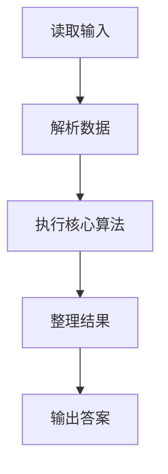
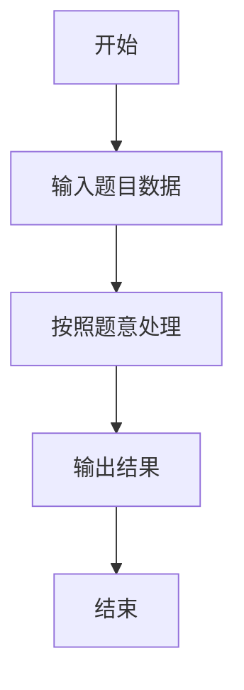

# L1-081 - 今天我要赢（5 分）

- **时间限制**: 400 ms
- **内存限制**: 65536 KB
- **代码长度限制**: 16 KB

---

## 题目描述


2018 年我们曾经出过一题，是输出“2018 我们要赢”。今年是 2022 年，你要输出的句子变成了“我要赢！就在今天！”然后以比赛当天的日期落款。

### 输入格式:

本题没有输入。

### 输出格式:

输出分 2 行。在第一行中输出 `I'm gonna win! Today!`，在第二行中用 `年年年年-月月-日日` 的格式输出比赛当天的日期。已知比赛的前一天是 `2022-04-22`。

### 输入样例:
```in
无
```

### 输出样例:
```out
I'm gonna win! Today!
这一行的内容我不告诉你…… 你要自己输出正确的日期呀~
```

## 示例

### 示例 1

**输入:**
```
无
```

**输出:**
```
I'm gonna win! Today!
这一行的内容我不告诉你…… 你要自己输出正确的日期呀~
```

### 解题思路

本题的 Ruby 实现采用字符串解析与规则处理。程序先读取题目输入，建立与题意对应的数据结构，按照约束完成核心计算，并按规定格式输出结果。具体实现以同目录的 main.rb 为准。

### 代码流程说明

1. 读取并解析标准输入，转换为题目所需的数据结构。
2. 按题意执行核心算法，维护中间状态并处理边界情况。
3. 整理计算结果，按照输出格式生成答案。

### 代码实现

完整实现位于同目录的 [main.rb](./L1-081_今天我要赢/main.rb)，以下代码与该入口文件保持一致。

```ruby
# frozen_string_literal: true
require_relative '../gplt_runtime'
def entry
  py_print("I'm gonna win! Today!\n2022-04-23", sep: " ", ending: "\n")
end
entry
```

### 代码流程图



### 解题流程图


