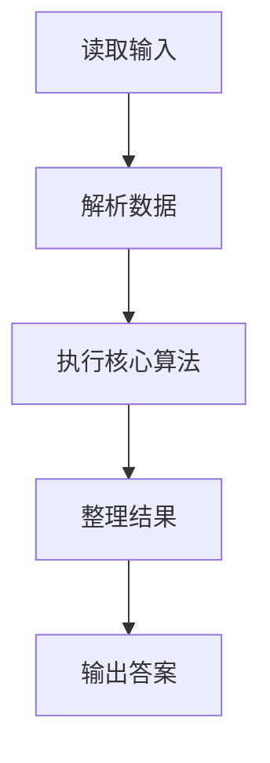
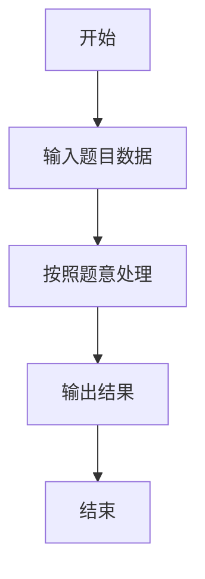

# L1-083 - 谁能进图书馆（10 分）

- **时间限制**: 400 ms
- **内存限制**: 65536 KB
- **代码长度限制**: 16 KB

---

## 题目描述


为了保障安静的阅读环境，有些公共图书馆对儿童入馆做出了限制。例如“12 岁以下儿童禁止入馆，除非有 18 岁以上（包括 18 岁）的成人陪同”。现在有两位小/大朋友跑来问你，他们能不能进去？请你写个程序自动给他们一个回复。

### 输入格式:

输入在一行中给出 4 个整数：
```
禁入年龄线 陪同年龄线 询问者1的年龄 询问者2的年龄
```

这里的`禁入年龄线`是指严格小于该年龄的儿童禁止入馆；`陪同年龄线`是指大于等于该年龄的人士可以陪同儿童入馆。默认两个询问者的编号依次分别为 `1` 和 `2`；年龄和年龄线都是 [1, 200] 区间内的整数，并且保证 `陪同年龄线` 严格大于 `禁入年龄线`。

### 输出格式:

在一行中输出对两位询问者的回答，如果可以进就输出 `年龄-Y`，否则输出 `年龄-N`，中间空 1 格，行首尾不得有多余空格。

在第二行根据两个询问者的情况输出一句话：

- 如果两个人必须一起进，则输出 `qing X zhao gu hao Y`，其中 `X` 是陪同人的编号， `Y` 是小孩子的编号；
- 如果两个人都可以进但不是必须一起的，则输出 `huan ying ru guan`；
- 如果两个人都进不去，则输出 `zhang da zai lai ba`；
- 如果一个人能进一个不能，则输出 `X: huan ying ru guan`，其中 `X` 是可以入馆的那个人的编号。

### 输入样例 1：
```in
12 18 18 8
```

### 输出样例 1：
```out
18-Y 8-Y
qing 1 zhao gu hao 2
```

### 输入样例 2：
```in
12 18 10 15
```

### 输出样例 2：
```out
10-N 15-Y
2: huan ying ru guan
```

## 示例

### 示例 1

**输入:**
```
12 18 18 8
```

**输出:**
```
18-Y 8-Y
qing 1 zhao gu hao 2
```

### 示例 2

**输入:**
```
12 18 10 15
```

**输出:**
```
10-N 15-Y
2: huan ying ru guan
```

### 解题思路

本题的 Ruby 实现采用字符串解析与规则处理。程序先读取题目输入，建立与题意对应的数据结构，按照约束完成核心计算，并按规定格式输出结果。具体实现以同目录的 main.rb 为准。

### 代码流程说明

1. 读取并解析标准输入，转换为题目所需的数据结构。
2. 按题意执行核心算法，维护中间状态并处理边界情况。
3. 整理计算结果，按照输出格式生成答案。

### 代码实现

完整实现位于同目录的 [main.rb](./L1-083_谁能进图书馆/main.rb)，以下代码与该入口文件保持一致。

```ruby
# frozen_string_literal: true
require_relative '../gplt_runtime'
def entry
  f, c, a, b = py_map(->(x) { py_int(x) }, py_tokens)
  t1 = (((a < f)) && ((b >= c)))
  t2 = (((b < f)) && ((a >= c)))
  x = (((a >= f)) || py_truth(t1))
  y = (((b >= f)) || py_truth(t2))
  py_print("%s-%s %s-%s" % [a, (x ? "Y" : "N"), b, (y ? "Y" : "N")], sep: " ", ending: "\n")
  py_print((t1 ? "qing 2 zhao gu hao 1" : (t2 ? "qing 1 zhao gu hao 2" : ((py_truth(x) && py_truth(y)) ? "huan ying ru guan" : (((!py_truth(x)) && (!py_truth(y))) ? "zhang da zai lai ba" : "%s: huan ying ru guan" % [(x ? 1 : 2)])))), sep: " ", ending: "\n")
end
entry
```

### 代码流程图



### 解题流程图


