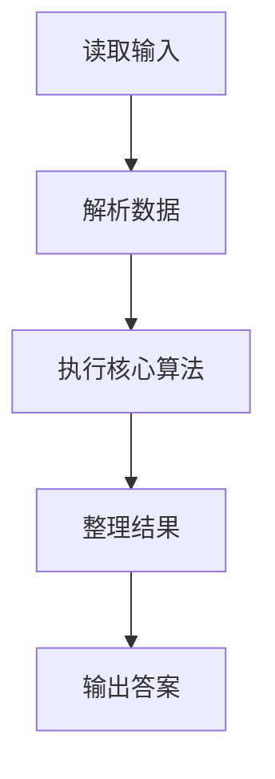
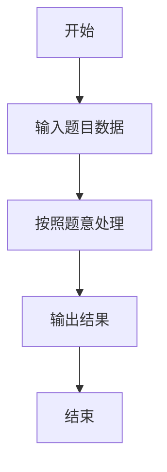

# L1-085 - 试试手气（15 分）

- **时间限制**: 400 ms
- **内存限制**: 65536 KB
- **代码长度限制**: 16 KB

---

## 题目描述


我们知道一个骰子有 6 个面，分别刻了 1 到 6 个点。下面给你 6 个骰子的初始状态，即它们朝上一面的点数，让你一把抓起摇出另一套结果。假设你摇骰子的手段特别精妙，每次摇出的结果都满足以下两个条件：

- 1、每个骰子摇出的点数都跟它之前任何一次出现的点数不同；
- 2、在满足条件 1 的前提下，每次都能让每个骰子得到可能得到的最大点数。

那么你应该可以预知自己第 $$n$$ 次（$$1\le n\le 5$$）摇出的结果。

### 输入格式:

输入第一行给出 6 个骰子的初始点数，即 [1,6] 之间的整数，数字间以空格分隔；第二行给出摇的次数 $$n$$（$$1\le n\le 5$$）。

### 输出格式:

在一行中顺序列出第 $$n$$ 次摇出的每个骰子的点数。数字间必须以 1 个空格分隔，行首位不得有多余空格。

### 输入样例:
```in
3 6 5 4 1 4
3
```

### 输出样例:
```out
4 3 3 3 4 3
```

## 示例

### 示例 1

**输入:**
```
3 6 5 4 1 4
3
```

**输出:**
```
4 3 3 3 4 3
```

### 解题思路

本题的 Ruby 实现采用字符串解析与规则处理。程序先读取题目输入，建立与题意对应的数据结构，按照约束完成核心计算，并按规定格式输出结果。具体实现以同目录的 main.rb 为准。

### 代码流程说明

1. 读取并解析标准输入，转换为题目所需的数据结构。
2. 按题意执行核心算法，维护中间状态并处理边界情况。
3. 整理计算结果，按照输出格式生成答案。

### 代码实现

完整实现位于同目录的 [main.rb](./main.rb)，以下代码与该入口文件保持一致。

```ruby
# frozen_string_literal: true
require_relative '../gplt_runtime'
def entry
  v = (py_map(->(x) { py_int(x) }, py_tokens).to_a)
  init = py_slice(v, nil, 6, nil)
  n = v[6]
  out = []
  for x in init
    k = n
    for y in py_range(6, 0, (-1))
      if ((y != x))
        k -= 1
      end
      if ((k == 0))
        out.append(py_str(y))
        break
      end
    end
  end
  py_print(out.join(" "), sep: " ", ending: "\n")
end
entry
```

### 代码流程图



### 解题流程图


