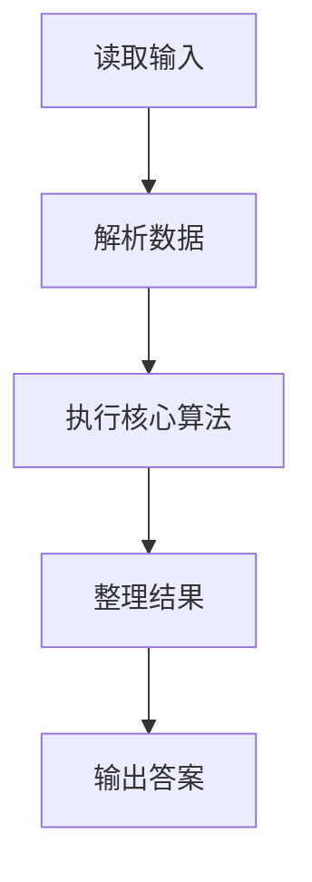
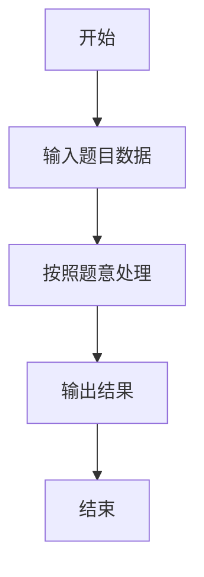

# L1-086 - 斯德哥尔摩火车上的题（15 分）

- **时间限制**: 400 ms
- **内存限制**: 65536 KB
- **代码长度限制**: 16 KB

---

## 题目描述


上图是新浪微博上的一则趣闻，是瑞典斯德哥尔摩火车上的一道题，看上去是段伪代码：

```
s = ''
a = '1112031584'
for (i = 1; i < length(a); i++) {
  if (a[i] % 2 == a[i-1] % 2) {
    s += max(a[i], a[i-1])
  }
}
goto_url('www.multisoft.se/' + s)
```

其中字符串的 `+` 操作是连接两个字符串的意思。所以这道题其实是让大家访问网站 `www.multisoft.se/112358`（**注意：比赛中千万不要访问这个网址！！！**）。

当然，能通过上述算法得到 `112358` 的原始字符串 `a` 是不唯一的。本题就请你判断，两个给定的原始字符串，能否通过上述算法得到相同的输出？

### 输入格式:

输入为两行仅由数字组成的非空字符串，长度均不超过 $$10^4$$，以回车结束。

### 输出格式:

对两个字符串分别采用上述斯德哥尔摩火车上的算法进行处理。如果两个结果是一样的，则在一行中输出那个结果；否则分别输出各自对应的处理结果，每个占一行。题目保证输出结果不为空。

### 输入样例 1：
```in
1112031584
011102315849
```

### 输出样例 1：
```out
112358
```

### 输入样例 2：
```in
111203158412334
12341112031584
```

### 输出样例 2：
```out
1123583
112358
```

## 示例

### 示例 1

**输入:**
```
1112031584
011102315849
```

**输出:**
```
112358
```

### 示例 2

**输入:**
```
111203158412334
12341112031584
```

**输出:**
```
1123583
112358
```

### 解题思路

本题的 Ruby 实现采用字符串解析与规则处理。程序先读取题目输入，建立与题意对应的数据结构，按照约束完成核心计算，并按规定格式输出结果。具体实现以同目录的 main.rb 为准。

### 代码流程说明

1. 读取并解析标准输入，转换为题目所需的数据结构。
2. 按题意执行核心算法，维护中间状态并处理边界情况。
3. 整理计算结果，按照输出格式生成答案。

### 代码实现

完整实现位于同目录的 [main.rb](./main.rb)，以下代码与该入口文件保持一致。

```ruby
# frozen_string_literal: true
require_relative '../gplt_runtime'
def entry
  a, b = py_slice(py_lines, nil, 2, nil)
  f = lambda do |s|
    return py_iterable(py_range(1, py_len(s))).flat_map { |i|; next [] unless py_truth((((py_int(s[(i - 1)]) % 2) == (py_int(s[i]) % 2)))); [py_str(py_max(py_int(s[(i - 1)]), py_int(s[i])))] }.join("")
  end
  x, y = [f.call(a), f.call(b)]
  py_print(x, sep: " ", ending: "\n")
  (((x != y)) ? py_print(y, sep: " ", ending: "\n") : nil)
end
entry
```

### 代码流程图



### 解题流程图


