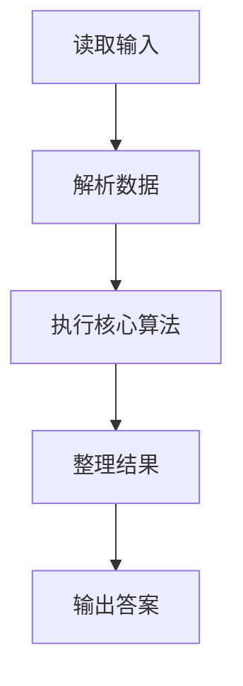
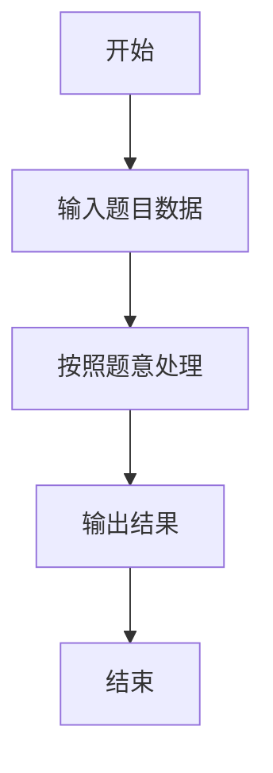

# L1-087 - 机工士姆斯塔迪奥（20 分）

- **时间限制**: 400 ms
- **内存限制**: 65536 KB
- **代码长度限制**: 16 KB

---

## 题目描述


在 MMORPG《最终幻想14》的副本“乐欲之所瓯博讷修道院”里，BOSS 机工士姆斯塔迪奥将会接受玩家的挑战。

你需要处理这个副本其中的一个机制：$N \times M$ 大小的地图被拆分为了 $N \times M$ 个 $1 \times 1$ 的格子，BOSS 会选择若干行或/及若干列释放技能，玩家不能站在释放技能的方格上，否则就会被击中而失败。

给定 BOSS 所有释放技能的行或列信息，请你计算出最后有多少个格子是安全的。

### 输入格式:

输入第一行是三个整数 $N, M, Q$ ($1 \le N \times M \le 10^5$，$0 \le Q \le 1000$)，表示地图为 $N$ 行 $M$ 列大小以及选择的行/列数量。

接下来 $Q$ 行，每行两个数 $T_i, C_i$，其中 $T_i = 0$ 表示 BOSS 选择的是一整行，$T_i = 1$ 表示选择的是一整列，$C_i$ 为选择的行号/列号。行和列的编号均从 1 开始。

### 输出格式:

输出一个数，表示安全格子的数量。

### 输入样例:
```in
5 5 3
0 2
0 4
1 3
```

### 输出样例:
```out
12
```

## 示例

### 示例 1

**输入:**
```
5 5 3
0 2
0 4
1 3
```

**输出:**
```
12
```

### 解题思路

本题的 Ruby 实现采用字符串解析与规则处理。程序先读取题目输入，建立与题意对应的数据结构，按照约束完成核心计算，并按规定格式输出结果。具体实现以同目录的 main.rb 为准。

### 代码流程说明

1. 读取并解析标准输入，转换为题目所需的数据结构。
2. 按题意执行核心算法，维护中间状态并处理边界情况。
3. 整理计算结果，按照输出格式生成答案。

### 代码实现

完整实现位于同目录的 [main.rb](./L1-087_机工士姆斯塔迪奥/main.rb)，以下代码与该入口文件保持一致。

```ruby
# frozen_string_literal: true
require_relative '../gplt_runtime'
def entry
  it = py_iter(py_map(->(x) { py_int(x) }, py_tokens))
  n, m, q = [py_next(it), py_next(it), py_next(it)]
  r = Set.new([])
  c = Set.new([])
  for _ in py_range(q)
    t, x = [py_next(it), py_next(it)]
    (((t == 0)) ? r : c).add(x)
  end
  py_print(((n - py_len(r)) * (m - py_len(c))), sep: " ", ending: "\n")
end
entry
```

### 代码流程图



### 解题流程图


