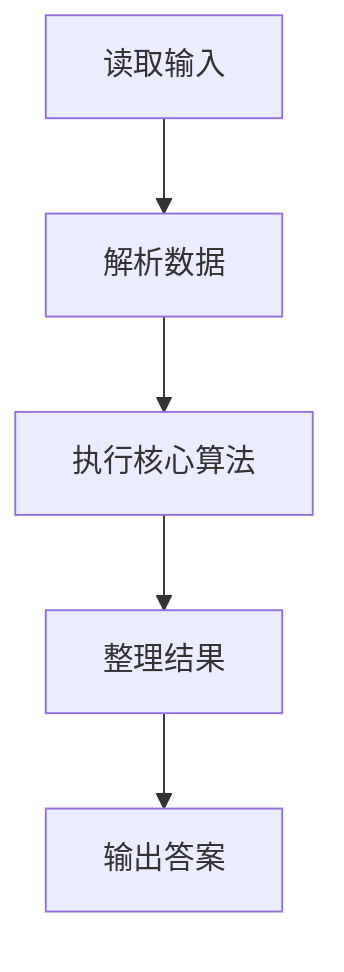
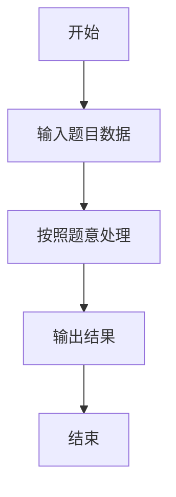

# L1-093 - 猜帽子游戏（15 分）

- **时间限制**: 400 ms
- **内存限制**: 65536 KB
- **代码长度限制**: 16 KB

---

## 题目描述


宝宝们在一起玩一个猜帽子游戏。每人头上被扣了一顶帽子，有的是黑色的，有的是黄色的。每个人可以看到别人头上的帽子，但是看不到自己的。游戏开始后，每个人可以猜自己头上的帽子是什么颜色，或者可以弃权不猜。如果没有一个人猜错、并且至少有一个人猜对了，那么所有的宝宝共同获得一个大奖。如果所有人都不猜，或者只要有一个人猜错了，所有宝宝就都没有奖。
下面顺序给出一排帽子的颜色，假设每一群宝宝来玩的时候，都是按照这个顺序发帽子的。然后给出每一群宝宝们猜的结果，请你判断他们能不能得大奖。

### 输入格式:

输入首先在一行中给出一个正整数 $$N$$（$$2 < N \le 100$$），是帽子的个数。第二行给出 $$N$$ 顶帽子的颜色，数字 `1` 表示黑色，`2` 表示黄色。
再下面给出一个正整数 $$K$$（$$\le 10$$），随后 $$K$$ 行，每行给出一群宝宝们猜的结果，除了仍然用数字 `1` 表示黑色、`2` 表示黄色之外，`0` 表示这个宝宝弃权不猜。
同一行中的数字用空格分隔。

### 输出格式:

对于每一群玩游戏的宝宝，如果他们能获得大奖，就在一行中输出 `Da Jiang!!!`，否则输出 `Ai Ya`。

### 输入样例:
```in
5
1 1 2 1 2
3
0 1 2 0 0
0 0 0 0 0
1 2 2 0 2
```

### 输出样例:
```out
Da Jiang!!!
Ai Ya
Ai Ya
```

## 示例

### 示例 1

**输入:**
```
5
1 1 2 1 2
3
0 1 2 0 0
0 0 0 0 0
1 2 2 0 2
```

**输出:**
```
Da Jiang!!!
Ai Ya
Ai Ya
```

### 解题思路

本题的 Ruby 实现采用字符串解析与规则处理。程序先读取题目输入，建立与题意对应的数据结构，按照约束完成核心计算，并按规定格式输出结果。具体实现以同目录的 main.rb 为准。

### 代码流程说明

1. 读取并解析标准输入，转换为题目所需的数据结构。
2. 按题意执行核心算法，维护中间状态并处理边界情况。
3. 整理计算结果，按照输出格式生成答案。

### 代码实现

完整实现位于同目录的 [main.rb](./L1-093_猜帽子游戏/main.rb)，以下代码与该入口文件保持一致。

```ruby
# frozen_string_literal: true
require_relative '../gplt_runtime'
def entry
  it = py_iter(py_map(->(x) { py_int(x) }, py_tokens))
  n = py_next(it)
  hat = py_iterable(py_range(n)).flat_map { |_|; [py_next(it)] }
  out = []
  for _ in py_range(py_next(it))
    g = py_iterable(py_range(n)).flat_map { |_|; [py_next(it)] }
    out.append(((py_truth(g.any?) && py_truth(py_iterable(py_enumerate(g)).flat_map { |__item_0|; i, x = __item_0; [(((x == 0)) || ((x == hat[i])))] }.all?)) ? "Da Jiang!!!" : "Ai Ya"))
  end
  py_print(out.join("\n"), sep: " ", ending: "\n")
end
entry
```

### 代码流程图



### 解题流程图


