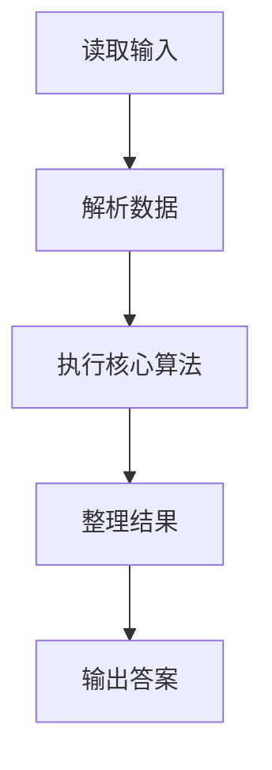
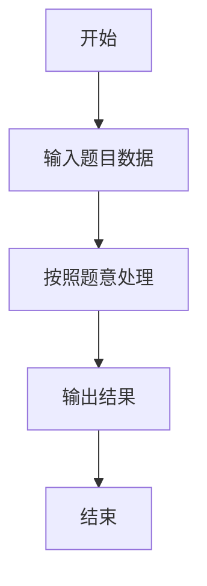

# L1-094 - 剪切粘贴（15 分）

- **时间限制**: 400 ms
- **内存限制**: 65536 KB
- **代码长度限制**: 16 KB

---

## 题目描述


使用计算机进行文本编辑时常见的功能是剪切功能（快捷键：Ctrl + X）。请实现一个简单的具有剪切和粘贴功能的文本编辑工具。

工具需要完成一系列剪切后粘贴的操作，每次操作分为两步：

* 剪切：给定需操作的起始位置和结束位置，将当前字符串中起始位置到结束位置部分的字符串放入剪贴板中，并删除当前字符串对应位置的内容。例如，当前字符串为 `abcdefg`，起始位置为 3，结束位置为 5，则剪贴操作后， 剪贴板内容为 `cde`，操作后字符串变为 `abfg`。字符串位置从 1 开始编号。
* 粘贴：给定插入位置的前后字符串，寻找到插入位置，将剪贴板内容插入到位置中，并清除剪贴板内容。例如，对于上面操作后的结果，给定插入位置前为 `bf`，插入位置后为 `g`，则插入后变为 `abfcdeg`。如找不到应该插入的位置，则直接将插入位置设置为字符串最后，仍然完成插入操作。查找字符串时区分大小写。

每次操作后的字符串即为新的当前字符串。在若干次操作后，请给出最后的编辑结果。

### 输入格式:

输入第一行是一个长度小于等于 200 的字符串 $S$，表示原始字符串。字符串只包含所有可见 ASCII 字符，不包含回车与空格。

第二行是一个正整数 $N$ ($1 \le N \le 100$)，表示要进行的操作次数。

接下来的 $N$ 行，每行是两个数字和两个**长度不大于 5** 的不包含空格的非空字符串，前两个数字表示需要剪切的位置，后两个字符串表示插入位置前和后的字符串，用一个空格隔开。如果有多个可插入的位置，选择最靠近当前操作字符串开头的一个。

剪切的位置保证总是合法的。

### 输出格式:

输出一行，表示操作后的字符串。

### 输入样例:
```in
AcrosstheGreatWall,wecanreacheverycornerintheworld
5
10 18 ery cor
32 40 , we
1 6 tW all
14 18 rnerr eache
1 1 e r
```

### 输出样例:
```out
he,allcornetrrwecaneacheveryGreatWintheworldAcross
```

## 示例

### 示例 1

**输入:**
```
AcrosstheGreatWall,wecanreacheverycornerintheworld
5
10 18 ery cor
32 40 , we
1 6 tW all
14 18 rnerr eache
1 1 e r
```

**输出:**
```
he,allcornetrrwecaneacheveryGreatWintheworldAcross
```

### 解题思路

本题的 Ruby 实现采用字符串解析与规则处理。程序先读取题目输入，建立与题意对应的数据结构，按照约束完成核心计算，并按规定格式输出结果。具体实现以同目录的 main.rb 为准。

### 代码流程说明

1. 读取并解析标准输入，转换为题目所需的数据结构。
2. 按题意执行核心算法，维护中间状态并处理边界情况。
3. 整理计算结果，按照输出格式生成答案。

### 代码实现

完整实现位于同目录的 [main.rb](./main.rb)，以下代码与该入口文件保持一致。

```ruby
# frozen_string_literal: true
require_relative '../gplt_runtime'
def entry
  it = py_iter(py_tokens)
  s = py_next(it).to_s
  for _ in py_range(py_int(py_next(it)))
    l, r = [py_int(py_next(it)), py_int(py_next(it))]
    before, after = [py_next(it).to_s, py_next(it).to_s]
    clip = py_slice(s, (l - 1), r, nil)
    s = (py_slice(s, nil, (l - 1), nil) + py_slice(s, r, nil, nil))
    p = s.index((before + after)) || -1
    p = (((p < 0)) ? py_len(s) : (p + py_len(before)))
    s = ((py_slice(s, nil, p, nil) + clip) + py_slice(s, p, nil, nil))
  end
  py_print(s, sep: " ", ending: "\n")
end
entry
```

### 代码流程图



### 解题流程图


