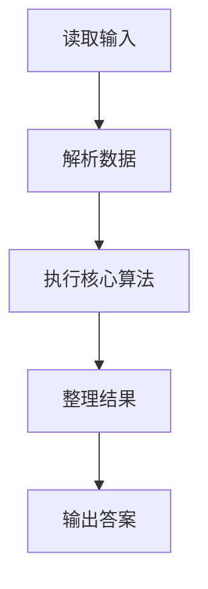
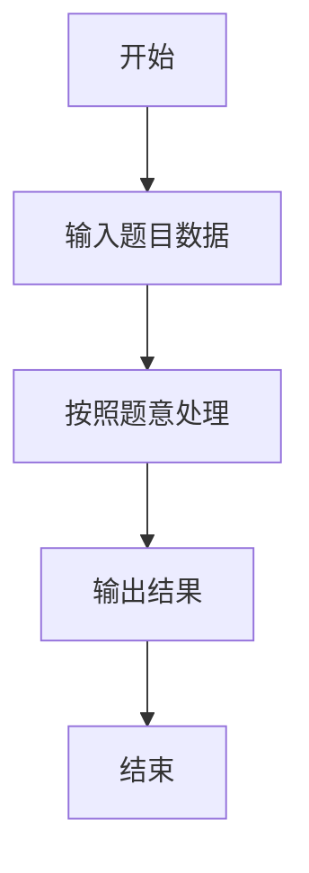

# L1-095 - 分寝室（20 分）

- **时间限制**: 400 ms
- **内存限制**: 65536 KB
- **代码长度限制**: 16 KB

---

## 题目描述


学校新建了宿舍楼，共有 $n$ 间寝室。等待分配的学生中，有女生 $n_0$ 位、男生 $n_1$ 位。所有待分配的学生都必须分到一间寝室。所有的寝室都要分出去，最后不能有寝室留空。\
现请你写程序完成寝室的自动分配。分配规则如下：

* 男女生不能混住；
* 不允许单人住一间寝室；
* 对每种性别的学生，每间寝室入住的人数都必须相同；例如不能出现一部分寝室住 2 位女生，一部分寝室住 3 位女生的情况。但女生寝室都是 2 人一间，男生寝室都是 3 人一间，则是允许的；
* 在有多种分配方案满足前面三项要求的情况下，要求两种性别每间寝室入住的人数差最小。

### 输入格式:

输入在一行中给出 3 个正整数 $n_0$、$n_1$、$n$，分别对应女生人数、男生人数、寝室数。数字间以空格分隔，均不超过 $10^5$。

### 输出格式:

在一行中顺序输出女生和男生被分配的寝室数量，其间以 1 个空格分隔。行首尾不得有多余空格。\
如果有解，题目保证解是唯一的。如果无解，则在一行中输出 `No Solution`。

### 输入样例 1：
```in
24 60 10
```

### 输出样例 1：
```out
4 6
```

### 输入样例 2：
```in
29 30 10
```

### 输出样例 2：
```out
No Solution
```

## 示例

### 示例 1

**输入:**
```
24 60 10
```

**输出:**
```
4 6
```

### 示例 2

**输入:**
```
29 30 10
```

**输出:**
```
No Solution
```

### 解题思路

本题的 Ruby 实现采用字符串解析与规则处理。程序先读取题目输入，建立与题意对应的数据结构，按照约束完成核心计算，并按规定格式输出结果。具体实现以同目录的 main.rb 为准。

### 代码流程说明

1. 读取并解析标准输入，转换为题目所需的数据结构。
2. 按题意执行核心算法，维护中间状态并处理边界情况。
3. 整理计算结果，按照输出格式生成答案。

### 代码实现

完整实现位于同目录的 [main.rb](./main.rb)，以下代码与该入口文件保持一致。

```ruby
# frozen_string_literal: true
require_relative '../gplt_runtime'
def entry
  g, b, n = py_map(->(x) { py_int(x) }, py_tokens)
  best = nil
  for x in py_range(1, n)
    y = (n - x)
    if ((((g % x) == 0)) && (((b % y) == 0)) && (((g.div(x)) >= 2)) && (((b.div(y)) >= 2)))
      z = py_abs(((g.div(x)) - (b.div(y))))
      if (((best.equal?(nil))) || ((z < best[0])))
        best = [z, x, y]
      end
    end
  end
  py_print((((best.equal?(nil))) ? "No Solution" : "%s %s" % [best[1], best[2]]), sep: " ", ending: "\n")
end
entry
```

### 代码流程图



### 解题流程图


