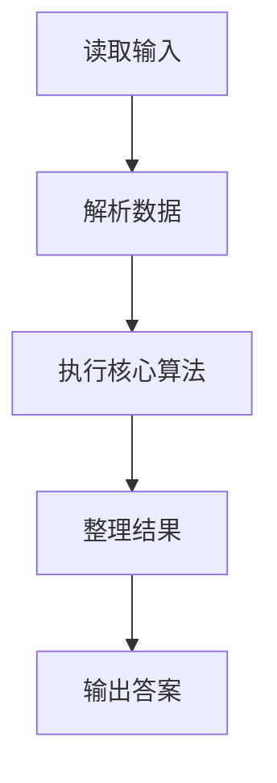
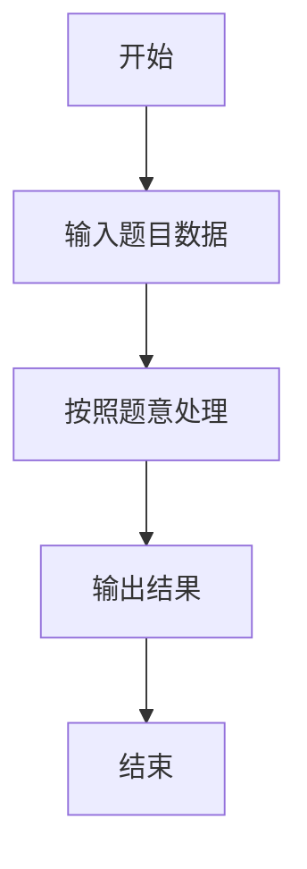

# L1-096 - 谁管谁叫爹（20 分）

- **时间限制**: 400 ms
- **内存限制**: 65536 KB
- **代码长度限制**: 16 KB

---

## 题目描述


《咱俩谁管谁叫爹》是网上一首搞笑饶舌歌曲，来源于东北酒桌上的助兴游戏。现在我们把这个游戏的难度拔高一点，多耗一些智商。
不妨设游戏中的两个人为 A 和 B。游戏开始后，两人同时报出两个整数 $$N_A$$ 和 $$N_B$$。判断谁是爹的标准如下：
- 将两个整数的各位数字分别相加，得到两个和 $$S_A$$ 和 $$S_B$$。如果 $$N_A$$ 正好是 $$S_B$$ 的整数倍，则 A 是爹；如果 $$N_B$$ 正好是 $$S_A$$ 的整数倍，则 B 是爹；
- 如果两人同时满足、或同时不满足上述判定条件，则原始数字大的那个是爹。
本题就请你写一个自动裁判程序，判定谁是爹。

### 输入格式:

输入第一行给出一个正整数 $$N$$（$$\le 100$$），为游戏的次数。以下 $$N$$ 行，每行给出一对不超过 9 位数的正整数，对应 A 和 B 给出的原始数字。题目保证两个数字不相等。

### 输出格式:

对每一轮游戏，在一行中给出赢得“爹”称号的玩家（`A` 或 `B`）。

### 输入样例:
```in
4
999999999 891
78250 3859
267537 52654299
6666 120
```

### 输出样例:
```out
B
A
B
A
```

## 示例

### 示例 1

**输入:**
```
4
999999999 891
78250 3859
267537 52654299
6666 120
```

**输出:**
```
B
A
B
A
```

### 解题思路

本题的 Ruby 实现采用字符串解析与规则处理。程序先读取题目输入，建立与题意对应的数据结构，按照约束完成核心计算，并按规定格式输出结果。具体实现以同目录的 main.rb 为准。

### 代码流程说明

1. 读取并解析标准输入，转换为题目所需的数据结构。
2. 按题意执行核心算法，维护中间状态并处理边界情况。
3. 整理计算结果，按照输出格式生成答案。

### 代码实现

完整实现位于同目录的 [main.rb](./main.rb)，以下代码与该入口文件保持一致。

```ruby
# frozen_string_literal: true
require_relative '../gplt_runtime'
def entry
  v = (py_map(->(x) { py_int(x) }, py_tokens).to_a)
  sm = lambda do |x|
    return py_sum(py_map(->(x) { py_int(x) }, py_str(x)))
  end
  out = []
  for a, b in py_zip(py_slice(v, 1, nil, 2), py_slice(v, 2, nil, 2))
    x = (((a % sm.call(b)) == 0))
    y = (((b % sm.call(a)) == 0))
    out.append((((py_truth(x) && (!py_truth(y))) || (((x == y)) && ((a > b)))) ? "A" : "B"))
  end
  py_print(out.join("\n"), sep: " ", ending: "\n")
end
entry
```

### 代码流程图



### 解题流程图


