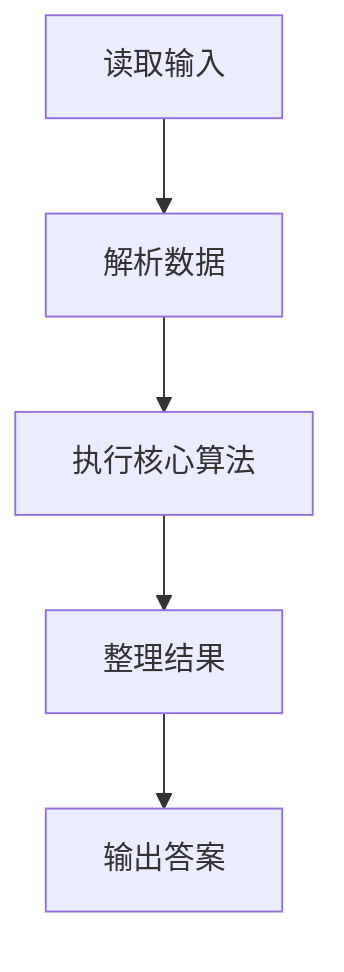
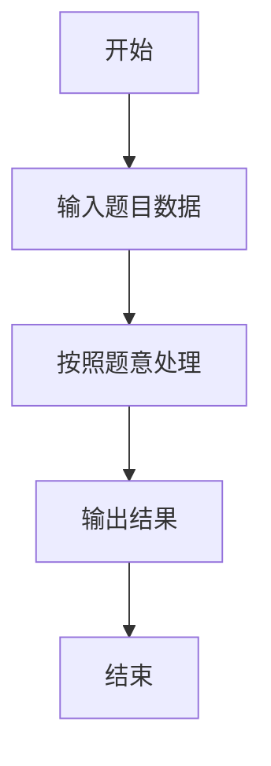

# L1-098 - 再进去几个人（5 分）

- **时间限制**: 400 ms
- **内存限制**: 65536 KB
- **代码长度限制**: 16 KB

---

## 题目描述


数学家、生物学家和物理学家坐在街头咖啡屋里，看着人们从街对面的一间房子走进走出。他们先看到两个人进去。时光流逝。他们又看到三个人出来。
物理学家:“测量不够准确。”
生物学家:“他们进行了繁殖。”
数学家:“如果现在再进去一个人，那房子就空了。”
下面就请你写个程序，根据进去和出来的人数，帮数学家算出来，再进去几个人，那房子就空了。

### 输入格式:

输入在一行中给出 2 个不超过 100 的正整数 A 和 B，其中 A 是进去的人数，B 是出来的人数。题目保证 B 比 A 要大。

### 输出格式:

在一行中输出使得房子变空的、需要再进去的人数。

### 输入样例:
```in
4 7
```

### 输出样例:
```out
3
```

## 示例

### 示例 1

**输入:**
```
4 7
```

**输出:**
```
3
```

### 解题思路

本题的 Ruby 实现采用字符串解析与规则处理。程序先读取题目输入，建立与题意对应的数据结构，按照约束完成核心计算，并按规定格式输出结果。具体实现以同目录的 main.rb 为准。

### 代码流程说明

1. 读取并解析标准输入，转换为题目所需的数据结构。
2. 按题意执行核心算法，维护中间状态并处理边界情况。
3. 整理计算结果，按照输出格式生成答案。

### 代码实现

完整实现位于同目录的 [main.rb](./main.rb)，以下代码与该入口文件保持一致。

```ruby
# frozen_string_literal: true
require_relative '../gplt_runtime'
def entry
  a, b = py_map(->(x) { py_int(x) }, py_tokens)
  py_print((b - a), sep: " ", ending: "\n")
end
entry
```

### 代码流程图



### 解题流程图


