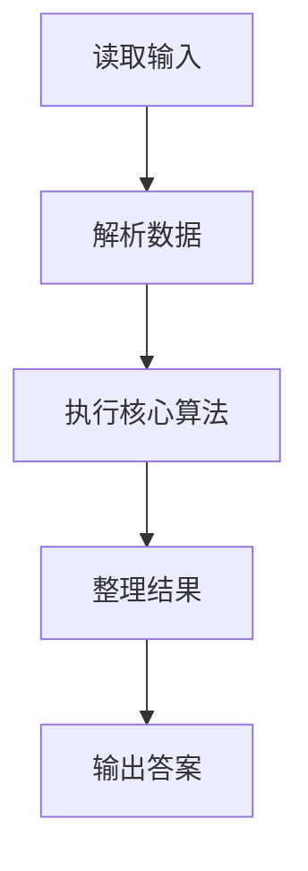
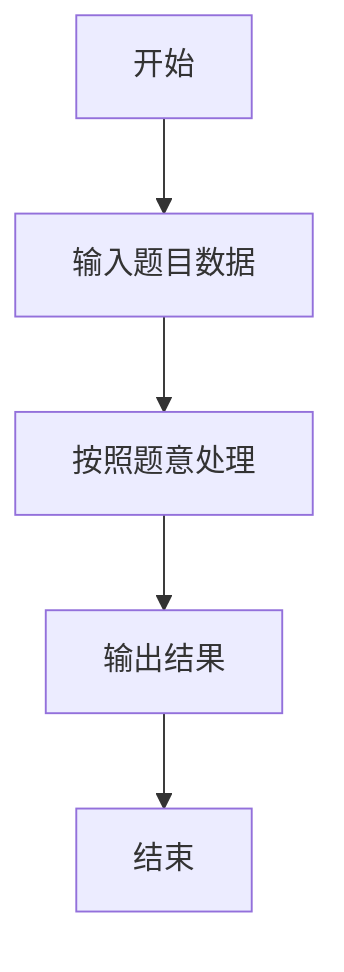

# L1-102 - 兰州牛肉面（15 分）

- **时间限制**: 400 ms
- **内存限制**: 65536 KB
- **代码长度限制**: 16 KB

---

## 题目描述


兰州牛肉面是历史悠久的美食，根据牛肉面的宽窄、配料的种类，可以细分为上百个不同的品种。你进到兰州的任何一家牛肉面馆，只说：“来一碗牛肉面！”就好像进到加州的咖啡馆说“来一杯咖啡”一样，会被店主人当成外星人……
本题的任务是，请你写程序帮助一家牛肉面馆的老板统计一下，他们一天卖出各种品种的牛肉面有多少碗，营业额一共有多少。

### 输入格式:

输入第一行给出一个正整数 $$N$$（$$\le 100$$），为牛肉面的种类数量。这里为了简单起见，我们把不同种类的牛肉面从 1 到 $$N$$ 编号，以后就用编号代替牛肉面品种的名称。第二行给出 $$N$$ 个价格，第 $$i$$ 个价格对应第 $$i$$ 种牛肉面一碗的单价。这里的价格是 [0.01, 200.00] 区间内的实数，以元为单位，精确到分。
随后是一天内客人买面的记录，每条记录占一行，格式为：
```
品种编号 碗数
```
其中`碗数`保证是正整数。当对应的 `品种编号` 为 `0` 时，表示输入结束。这个记录不算在内。

### 输出格式:

首先输出 $$N$$ 行，第 $$i$$ 行输出第 $$i$$ 种牛肉面卖出了多少碗。最后一行输出当天的总营业额，仍然是以元为单位，精确到分。题目保证总营业额不超过 $$10^6$$。

### 输入样例:
```in
5
4.00 8.50 3.20 12.00 14.10
3 5
5 2
1 1
2 3
2 2
1 9
0 0
```

### 输出样例:
```out
10
5
5
0
2
126.70
```

## 示例

### 示例 1

**输入:**
```
5
4.00 8.50 3.20 12.00 14.10
3 5
5 2
1 1
2 3
2 2
1 9
0 0
```

**输出:**
```
10
5
5
0
2
126.70
```

### 解题思路

本题的 Ruby 实现采用字符串解析与规则处理。程序先读取题目输入，建立与题意对应的数据结构，按照约束完成核心计算，并按规定格式输出结果。具体实现以同目录的 main.rb 为准。

### 代码流程说明

1. 读取并解析标准输入，转换为题目所需的数据结构。
2. 按题意执行核心算法，维护中间状态并处理边界情况。
3. 整理计算结果，按照输出格式生成答案。

### 代码实现

完整实现位于同目录的 [main.rb](./main.rb)，以下代码与该入口文件保持一致。

```ruby
# frozen_string_literal: true
require_relative '../gplt_runtime'
def entry
  v = py_input_data.split
  n = py_int(v[0])
  prices = py_iterable(py_slice(v, 1, (n + 1), nil)).flat_map { |x|; [((py_float(x) * 100).round(0))] }
  cnt = ([0] * n)
  total = 0
  i = (n + 1)
  while ((i < py_len(v)))
    x = py_int(v[i])
    q = py_int(v[(i + 1)])
    i += 2
    if ((x == 0))
      break
    end
    cnt[(x - 1)] += q
    total += (prices[(x - 1)] * q)
  end
  py_print(py_map(->(x) { py_str(x) }, cnt).join("\n"), sep: " ", ending: "\n")
  py_print("%s.%02d" % [(total.div(100)), (total % 100)], sep: " ", ending: "\n")
end
entry
```

### 代码流程图



### 解题流程图


