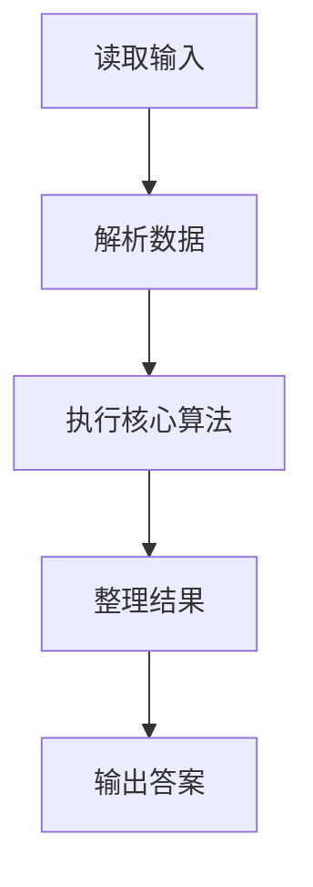

# L1-105 - 珍惜生命（5 分）

- **时间限制**: 400 ms
- **内存限制**: 65536 KB
- **代码长度限制**: 16 KB

---

## 题目描述


前辈工程师 Martin Golding 教育我们说：“Always code as if the guy who ends up maintaining your code will be a violent psychopath who knows where you live.”（写代码的时候，总是要把维护你代码的那个家伙想象成一个有暴力倾向的精神病，他还知道你住哪儿）。本题就请你直接在屏幕上输出这句话。

### 输入格式:

本题没有输入。

### 输出格式:

在一行中输出 `Always code as if the guy who ends up maintaining your code will be a violent psychopath who knows where you live.`。

### 输入样例:
```in
无
```

### 输出样例:
```out
Always code as if the guy who ends up maintaining your code will be a violent psychopath who knows where you live.
```

## 示例

### 示例 1

**输入:**
```
无
```

**输出:**
```
Always code as if the guy who ends up maintaining your code will be a violent psychopath who knows where you live.
```

### 解题思路

本题的 Ruby 实现采用字符串解析与规则处理。程序先读取题目输入，建立与题意对应的数据结构，按照约束完成核心计算，并按规定格式输出结果。具体实现以同目录的 main.rb 为准。

### 代码流程说明

1. 读取并解析标准输入，转换为题目所需的数据结构。
2. 按题意执行核心算法，维护中间状态并处理边界情况。
3. 整理计算结果，按照输出格式生成答案。

### 代码实现

完整实现位于同目录的 [main.rb](./main.rb)，以下代码与该入口文件保持一致。

```ruby
# frozen_string_literal: true
require_relative '../gplt_runtime'
def entry
  py_print("Always code as if the guy who ends up maintaining your code will be a violent psychopath who knows where you live.", sep: " ", ending: "\n")
end
entry
```

### 代码流程图



### 解题流程图


