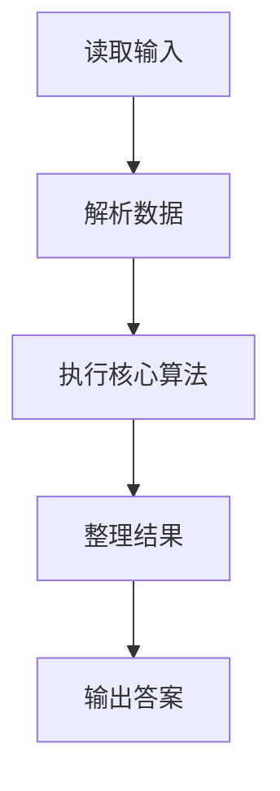
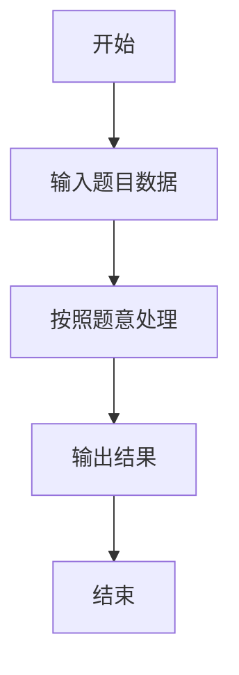

# L1-107 - 高温补贴（10 分）

- **时间限制**: 400 ms
- **内存限制**: 65536 KB
- **代码长度限制**: 16 KB

---

## 题目描述


高温补贴是为保证炎夏季节高温条件下经济建设和企业生产经营活动的正常进行，保障企业职工在劳动生产过程中的安全和身体健康进行的补贴。国家规定，用人单位安排劳动者在高温天气下（日最高气温达到 35° 以上），露天工作，以及不能采取有效措施将工作场所温度降低到 33° 以下的，应当向劳动者支付高温补贴。
给定当日最高气温、以及某用人单位的工作条件，请你写个程序判断，该单位员工能否获得高温补贴。

### 输入格式:

输入在一行中给出 3 个整数，即当日最高气温 $T$、工作场所状态 $S$、工作场所温度 $t$。其中温度为 $[-40, 50]$ 区间内的整数；工作场所状态为 1 表示露天，0 表示室内。

### 输出格式:

根据输入情况，如果可以获得高温补贴，则在一行中输出 `Bu Tie`（补贴），第二行输出 $T$ 的值；否则输出不补贴的原因：如果室内外温度都超标，仅仅是因为室内工作就不补贴，则输出 `Shi Nei`（室内），第二行输出 $T$ 的值；如果在室外工作但天气不热、或工作场所温度不高，则输出 `Bu Re`（不热），第二行输出 $t$ 的值；如果天气不热、或工作场所温度不高，且在室内工作，则输出 `Shu Shi`（舒适），第二行输出 $t$ 的值。

### 输入样例 1：
```in
36 1 33
```

### 输出样例 1：
```out
Bu Tie
36
```

### 输入样例 2：
```in
36 0 33
```

### 输出样例 2：
```out
Shi Nei
36
```

### 输入样例 3：
```in
36 1 27
```

### 输出样例 3：
```out
Bu Re
27
```

### 输入样例 4：
```in
36 0 24
```

### 输出样例 4：
```out
Shu Shi
24
```

## 示例

### 示例 1

**输入:**
```
36 1 33
```

**输出:**
```
Bu Tie
36
```

### 示例 2

**输入:**
```
36 0 33
```

**输出:**
```
Shi Nei
36
```

### 示例 3

**输入:**
```
36 1 27
```

**输出:**
```
Bu Re
27
```

### 示例 4

**输入:**
```
36 0 24
```

**输出:**
```
Shu Shi
24
```

### 解题思路

本题的 Ruby 实现采用字符串解析与规则处理。程序先读取题目输入，建立与题意对应的数据结构，按照约束完成核心计算，并按规定格式输出结果。具体实现以同目录的 main.rb 为准。

### 代码流程说明

1. 读取并解析标准输入，转换为题目所需的数据结构。
2. 按题意执行核心算法，维护中间状态并处理边界情况。
3. 整理计算结果，按照输出格式生成答案。

### 代码实现

完整实现位于同目录的 [main.rb](./L1-107_高温补贴/main.rb)，以下代码与该入口文件保持一致。

```ruby
# frozen_string_literal: true
require_relative '../gplt_runtime'
def entry
  py_t, py_s, t = py_map(->(x) { py_int(x) }, py_tokens)
  high = (((py_t >= 35)) && ((t >= 33)))
  py_print((py_truth(py_s) ? (high ? "Bu Tie" : "Bu Re") : (high ? "Shi Nei" : "Shu Shi")), sep: " ", ending: "\n")
  py_print((high ? py_t : t), sep: " ", ending: "\n")
end
entry
```

### 代码流程图



### 解题流程图


