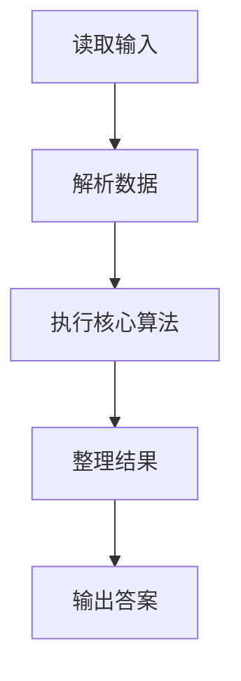
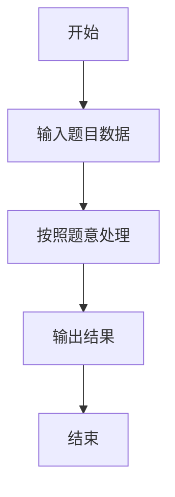

# L1-114 - 要刷多少题（5 分）

- **时间限制**: 400 ms
- **内存限制**: 65536 KB
- **代码长度限制**: 16 KB

---

## 题目描述


老师说：想在天梯赛取得好成绩，第一件事是把前面 $n$ 年的天梯赛真题做一遍。
已知每年的天梯赛有 15 道题目，全新不重复。请你算一下，一共要刷多少道真题？

### 输入格式:

输入第一行给出一个正整数 $n$（$\le 10$），为题面中所述老师提出的比赛年数。

### 输出格式:

在一行中输出学生需要做完的题目总数。

### 输入样例:
```in
2
```

### 输出样例:
```out
30
```

## 示例

### 示例 1

**输入:**
```
2
```

**输出:**
```
30
```

### 解题思路

本题的 Ruby 实现采用字符串解析与规则处理。程序先读取题目输入，建立与题意对应的数据结构，按照约束完成核心计算，并按规定格式输出结果。具体实现以同目录的 main.rb 为准。

### 代码流程说明

1. 读取并解析标准输入，转换为题目所需的数据结构。
2. 按题意执行核心算法，维护中间状态并处理边界情况。
3. 整理计算结果，按照输出格式生成答案。

### 代码实现

完整实现位于同目录的 [main.rb](./L1-114_要刷多少题/main.rb)，以下代码与该入口文件保持一致。

```ruby
# frozen_string_literal: true
require_relative '../gplt_runtime'
def entry
  py_print((py_int(py_tokens[0]) * 15), sep: " ", ending: "\n")
end
entry
```

### 代码流程图



### 解题流程图


