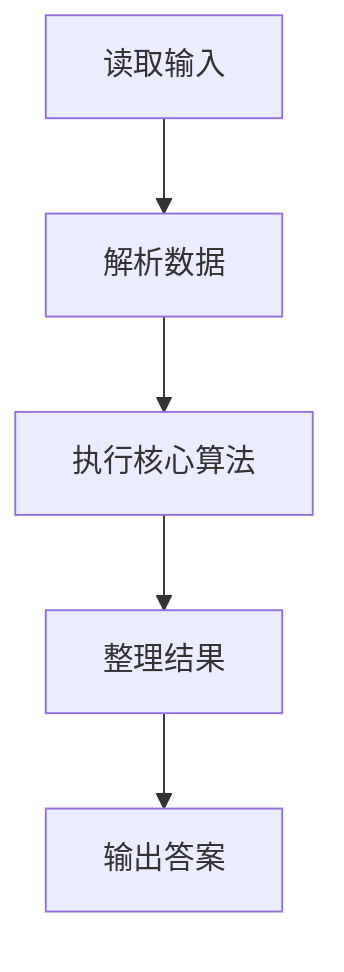
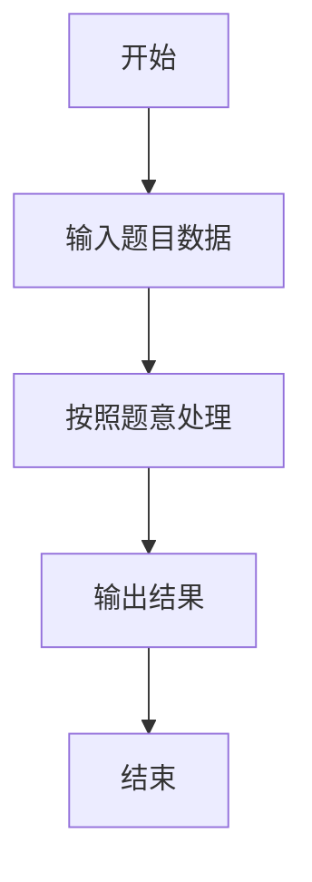

# L1-115 - 就挺突然的（10 分）

- **时间限制**: 400 ms
- **内存限制**: 65536 KB
- **代码长度限制**: 16 KB

---

## 题目描述


上面是新浪微博上的一张图，内容是“蹲厕所时突然想到，2026 年出生的孩子，能活到 3001 年”，就，挺突然的……

本题假设人类最长寿命为 250 岁，请你编写程序判断一下墙上的标语是否合理。

### 输入格式:

输入在一行给出 2 个不超过 5000 的正整数 $A$ 和 $B$，对应的标语为“蹲厕所时突然想到，$A$ 年出生的孩子，能活到 $B$ 年”。

### 输出格式:

首先在第一行输出写标语的人认为 $A$ 年出生的孩子有多长的寿命。如果该寿命超过了人类最长寿命，在第二行中输出 `jiu ting tu ran de...`；如果该寿命不是正数，输出 `hai sheng ma?`；如果寿命在正常范围内，输出 `nin tai cong ming le!`

### 输入样例 1：
```in
2026 3001
```

### 输出样例 1：
```out
975
jiu ting tu ran de...
```

### 输入样例 2：
```in
3001 2026
```

### 输出样例 2：
```out
-975
hai sheng ma?
```

### 输入样例 3：
```in
2025 2275
```

### 输出样例 3：
```out
250
nin tai cong ming le!
```

## 示例

### 示例 1

**输入:**
```
2026 3001
```

**输出:**
```
975
jiu ting tu ran de...
```

### 示例 2

**输入:**
```
3001 2026
```

**输出:**
```
-975
hai sheng ma?
```

### 示例 3

**输入:**
```
2025 2275
```

**输出:**
```
250
nin tai cong ming le!
```

### 解题思路

本题的 Ruby 实现采用字符串解析与规则处理。程序先读取题目输入，建立与题意对应的数据结构，按照约束完成核心计算，并按规定格式输出结果。具体实现以同目录的 main.rb 为准。

### 代码流程说明

1. 读取并解析标准输入，转换为题目所需的数据结构。
2. 按题意执行核心算法，维护中间状态并处理边界情况。
3. 整理计算结果，按照输出格式生成答案。

### 代码实现

完整实现位于同目录的 [main.rb](./L1-115_就挺突然的/main.rb)，以下代码与该入口文件保持一致。

```ruby
# frozen_string_literal: true
require_relative '../gplt_runtime'
def entry
  a, b = py_map(->(x) { py_int(x) }, py_tokens)
  x = (b - a)
  py_print(x, sep: " ", ending: "\n")
  py_print((((x <= 0)) ? "hai sheng ma?" : (((x <= 250)) ? "nin tai cong ming le!" : "jiu ting tu ran de...")), sep: " ", ending: "\n")
end
entry
```

### 代码流程图



### 解题流程图


