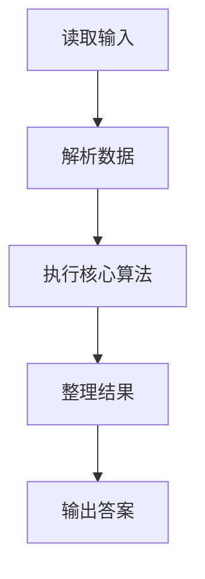
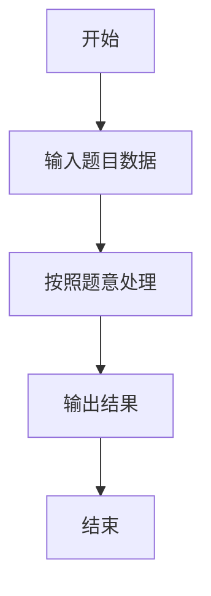

# L2-001 - 紧急救援（25 分）

- **时间限制**: 200 ms
- **内存限制**: 65536 KB
- **代码长度限制**: 16 KB

---

## 题目描述


作为一个城市的应急救援队伍的负责人，你有一张特殊的全国地图。在地图上显示有多个分散的城市和一些连接城市的快速道路。每个城市的救援队数量和每一条连接两个城市的快速道路长度都标在地图上。当其他城市有紧急求助电话给你的时候，你的任务是带领你的救援队尽快赶往事发地，同时，一路上召集尽可能多的救援队。

### 输入格式:

输入第一行给出4个正整数$$N$$、$$M$$、$$S$$、$$D$$，其中$$N$$（$$2\le N\le 500$$）是城市的个数，顺便假设城市的编号为0 ~ $$(N-1)$$；$$M$$是快速道路的条数；$$S$$是出发地的城市编号；$$D$$是目的地的城市编号。

第二行给出$$N$$个正整数，其中第$$i$$个数是第$$i$$个城市的救援队的数目，数字间以空格分隔。随后的$$M$$行中，每行给出一条快速道路的信息，分别是：城市1、城市2、快速道路的长度，中间用空格分开，数字均为整数且不超过500。输入保证救援可行且最优解唯一。

### 输出格式:

第一行输出最短路径的条数和能够召集的最多的救援队数量。第二行输出从$$S$$到$$D$$的路径中经过的城市编号。数字间以空格分隔，输出结尾不能有多余空格。

### 输入样例:
```in
4 5 0 3
20 30 40 10
0 1 1
1 3 2
0 3 3
0 2 2
2 3 2
```

### 输出样例:
```out
2 60
0 1 3
```

## 示例

### 示例 1

**输入:**
```
4 5 0 3
20 30 40 10
0 1 1
1 3 2
0 3 3
0 2 2
2 3 2
```

**输出:**
```
2 60
0 1 3
```

### 解题思路

本题的 Ruby 实现采用排序、贪心与顺序模拟。程序先读取题目输入，建立与题意对应的数据结构，按照约束完成核心计算，并按规定格式输出结果。具体实现以同目录的 main.rb 为准。

### 代码流程说明

1. 读取并解析标准输入，转换为题目所需的数据结构。
2. 按题意执行核心算法，维护中间状态并处理边界情况。
3. 整理计算结果，按照输出格式生成答案。

### 代码实现

完整实现位于同目录的 [main.rb](./main.rb)，以下代码与该入口文件保持一致。

```ruby
# frozen_string_literal: true
require_relative '../gplt_runtime'
def entry
  v = (py_map(->(x) { py_int(x) }, py_tokens).to_a)
  n, m, s, d = py_slice(v, nil, 4, nil)
  team = py_slice(v, 4, (4 + n), nil)
  g = py_iterable(py_range(n)).flat_map { |_|; [[]] }
  k = (4 + n)
  for _ in py_range(m)
    a, b, w = py_slice(v, k, (k + 3), nil)
    k += 3
    g[a].append([b, w])
    g[b].append([a, w])
  end
  inf = (10 ** 18)
  dist = ([inf] * n)
  cnt = ([0] * n)
  power = ([0] * n)
  pre = ([(-1)] * n)
  dist[s] = 0
  cnt[s] = 1
  power[s] = team[s]
  q = [[0, s]]
  while py_truth(q)
    du, u = q.shift
    if ((du != dist[u]))
      next
    end
    for w, x in g[u]
      nd = (du + x)
      np = (power[u] + team[w])
      if ((nd < dist[w]))
        dist[w] = nd
        cnt[w] = cnt[u]
        power[w] = np
        pre[w] = u
        q.push([nd, w]); q.sort!
        else
          if ((nd == dist[w]))
            cnt[w] += cnt[u]
            if ((np > power[w]))
              power[w] = np
              pre[w] = u
            end
          end
      end
    end
  end
  path = []
  u = d
  while ((u >= 0))
    path.append(u)
    u = pre[u]
  end
  py_print(cnt[d], power[d], sep: " ", ending: "\n")
  py_print(py_map(->(x) { py_str(x) }, py_slice(path, nil, nil, (-1))).join(" "), sep: " ", ending: "\n")
end
entry
```

### 代码流程图



### 解题流程图


