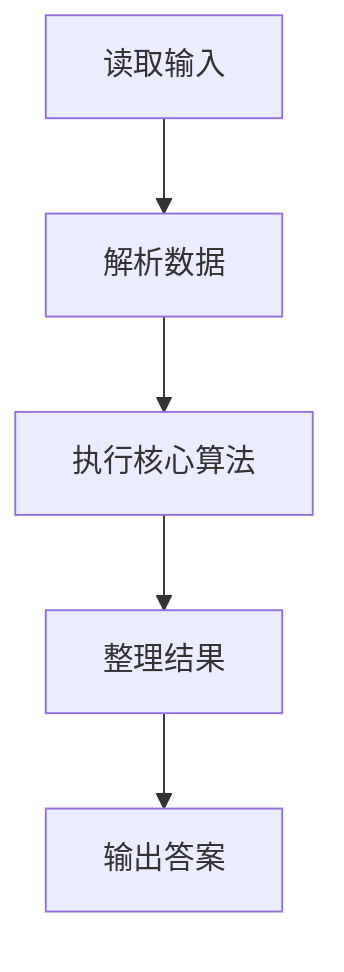
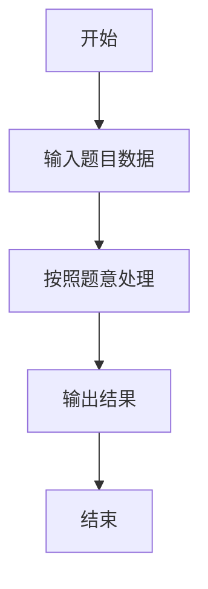

# L2-004 - 这是二叉搜索树吗？（25 分）

- **时间限制**: 400 ms
- **内存限制**: 65536 KB
- **代码长度限制**: 16 KB

---

## 题目描述


一棵二叉搜索树可被递归地定义为具有下列性质的二叉树：对于任一结点，

- 其左子树中所有结点的键值小于该结点的键值；
- 其右子树中所有结点的键值大于等于该结点的键值；
- 其左右子树都是二叉搜索树。

所谓二叉搜索树的“镜像”，即将所有结点的左右子树对换位置后所得到的树。

给定一个整数键值序列，现请你编写程序，判断这是否是对一棵二叉搜索树或其镜像进行前序遍历的结果。

### 输入格式:

输入的第一行给出正整数 $$N$$（$$\le 1000$$）。随后一行给出 $$N$$ 个整数键值，其间以空格分隔。

### 输出格式:

如果输入序列是对一棵二叉搜索树或其镜像进行前序遍历的结果，则首先在一行中输出 `YES` ，然后在下一行输出该树后序遍历的结果。数字间有 1 个空格，一行的首尾不得有多余空格。若答案是否，则输出 `NO`。

### 输入样例 1：
```in
7
8 6 5 7 10 8 11
```

### 输出样例 1：
```out
YES
5 7 6 8 11 10 8
```

### 输入样例 2：
```in
7
8 10 11 8 6 7 5
```

### 输出样例 2：
```out
YES
11 8 10 7 5 6 8
```

### 输入样例 3：
```in
7
8 6 8 5 10 9 11
```

### 输出样例 3：
```out
NO
```

## 示例

### 示例 1

**输入:**
```
7
8 6 5 7 10 8 11
```

**输出:**
```
YES
5 7 6 8 11 10 8
```

### 示例 2

**输入:**
```
7
8 10 11 8 6 7 5
```

**输出:**
```
YES
11 8 10 7 5 6 8
```

### 示例 3

**输入:**
```
7
8 6 8 5 10 9 11
```

**输出:**
```
NO
```

### 解题思路

本题的 Ruby 实现采用字符串解析与规则处理。程序先读取题目输入，建立与题意对应的数据结构，按照约束完成核心计算，并按规定格式输出结果。具体实现以同目录的 main.rb 为准。

### 代码流程说明

1. 读取并解析标准输入，转换为题目所需的数据结构。
2. 按题意执行核心算法，维护中间状态并处理边界情况。
3. 整理计算结果，按照输出格式生成答案。

### 代码实现

完整实现位于同目录的 [main.rb](./main.rb)，以下代码与该入口文件保持一致。

```ruby
# frozen_string_literal: true
require_relative '../gplt_runtime'
a = py_tokens.map(&:to_i)[1..]
def postorder(values, mirror)
  return [] if values.empty?
  root = values[0]
  i = 1
  if mirror
    i += 1 while i < values.length && values[i] >= root
    return nil if values[i..].any? { |x| x > root }
  else
    i += 1 while i < values.length && values[i] < root
    return nil if values[i..].any? { |x| x < root }
  end
  left = postorder(values[1, i - 1], mirror)
  right = postorder(values[i..] || [], mirror)
  return nil if left.nil? || right.nil?
  left + right + [root]
end
result = postorder(a, false) || postorder(a, true)
py_print(result ? "YES\n#{result.join(' ')}" : 'NO')
```

### 代码流程图



### 解题流程图


