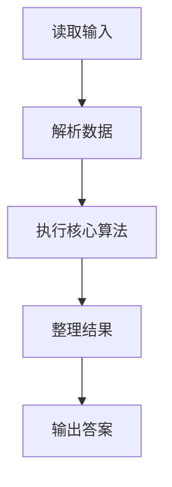
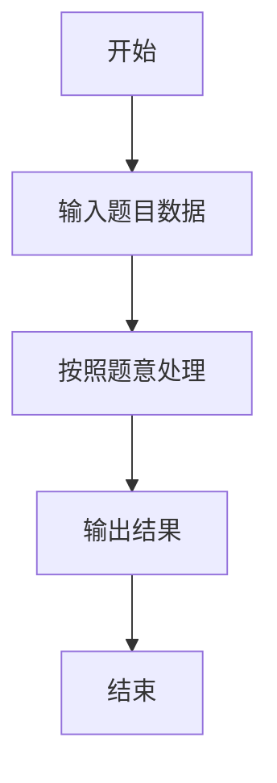

# L2-007 - 家庭房产（25 分）

- **时间限制**: 400 ms
- **内存限制**: 65536 KB
- **代码长度限制**: 16 KB

---

## 题目描述


给定每个人的家庭成员和其自己名下的房产，请你统计出每个家庭的人口数、人均房产面积及房产套数。

### 输入格式:

输入第一行给出一个正整数$$N$$（$$\le 1000$$），随后$$N$$行，每行按下列格式给出一个人的房产：
```
编号 父 母 k 孩子1 ... 孩子k 房产套数 总面积
```
其中`编号`是每个人独有的一个4位数的编号；`父`和`母`分别是该编号对应的这个人的父母的编号（如果已经过世，则显示`-1`）；`k`（$$0\le$$`k`$$\le 5$$）是该人的子女的个数；`孩子i`是其子女的编号。

### 输出格式:

首先在第一行输出家庭个数（所有有亲属关系的人都属于同一个家庭）。随后按下列格式输出每个家庭的信息：
```
家庭成员的最小编号 家庭人口数 人均房产套数 人均房产面积
```
其中人均值要求保留小数点后3位。家庭信息首先按人均面积降序输出，若有并列，则按成员编号的升序输出。

### 输入样例:
```in
10
6666 5551 5552 1 7777 1 100
1234 5678 9012 1 0002 2 300
8888 -1 -1 0 1 1000
2468 0001 0004 1 2222 1 500
7777 6666 -1 0 2 300
3721 -1 -1 1 2333 2 150
9012 -1 -1 3 1236 1235 1234 1 100
1235 5678 9012 0 1 50
2222 1236 2468 2 6661 6662 1 300
2333 -1 3721 3 6661 6662 6663 1 100
```

### 输出样例:
```out
3
8888 1 1.000 1000.000
0001 15 0.600 100.000
5551 4 0.750 100.000
```

## 示例

### 示例 1

**输入:**
```
10
6666 5551 5552 1 7777 1 100
1234 5678 9012 1 0002 2 300
8888 -1 -1 0 1 1000
2468 0001 0004 1 2222 1 500
7777 6666 -1 0 2 300
3721 -1 -1 1 2333 2 150
9012 -1 -1 3 1236 1235 1234 1 100
1235 5678 9012 0 1 50
2222 1236 2468 2 6661 6662 1 300
2333 -1 3721 3 6661 6662 6663 1 100
```

**输出:**
```
3
8888 1 1.000 1000.000
0001 15 0.600 100.000
5551 4 0.750 100.000
```

### 解题思路

本题的 Ruby 实现采用并查集或连通性维护。程序先读取题目输入，建立与题意对应的数据结构，按照约束完成核心计算，并按规定格式输出结果。具体实现以同目录的 main.rb 为准。

### 代码流程说明

1. 读取并解析标准输入，转换为题目所需的数据结构。
2. 按题意执行核心算法，维护中间状态并处理边界情况。
3. 整理计算结果，按照输出格式生成答案。

### 代码实现

完整实现位于同目录的 [main.rb](./main.rb)，以下代码与该入口文件保持一致。

```ruby
# frozen_string_literal: true
require_relative '../gplt_runtime'
tokens = py_tokens
n = tokens.shift.to_i
parent = Array.new(10_000) { |i| i }
exists = Array.new(10_000, false)
houses = Array.new(10_000, 0)
area = Array.new(10_000, 0.0)
min_id = Array.new(10_000) { |i| i }
find = lambda do |x|
  while parent[x] != x
    parent[x] = parent[parent[x]]
    x = parent[x]
  end
  x
end
union = lambda do |a, b|
  ra = find.call(a); rb = find.call(b)
  next if ra == rb
  parent[rb] = ra
  min_id[ra] = [min_id[ra], min_id[rb]].min
end
n.times do
  id, father, mother, k = tokens.shift(4).map(&:to_i)
  [id, father, mother].each { |x| exists[x] = true if x && x >= 0 }
  exists[id] = true
  [father, mother].each { |x| union.call(id, x) if x >= 0 }
  k.times do
    child = tokens.shift.to_i
    exists[child] = true
    union.call(id, child)
  end
  h = tokens.shift.to_i
  ar = tokens.shift.to_f
  houses[id] += h
  area[id] += ar
end
groups = {}
10_000.times do |id|
  next unless exists[id]
  root = find.call(id)
  groups[root] ||= { ids: [], houses: 0, area: 0.0 }
  groups[root][:ids] << id
  groups[root][:houses] += houses[id]
  groups[root][:area] += area[id]
end
rows = groups.values.map do |g|
  ids = g[:ids]
  [ids.min, ids.length, g[:houses].to_f / ids.length, g[:area] / ids.length]
end.sort_by { |min, _, _, avg_area| [-avg_area, min] }
py_print(rows.length.to_s + "\n" + rows.map { |id, people, avg_h, avg_a| format('%04d %d %.3f %.3f', id, people, avg_h, avg_a) }.join("\n"))
```

### 代码流程图



### 解题流程图


