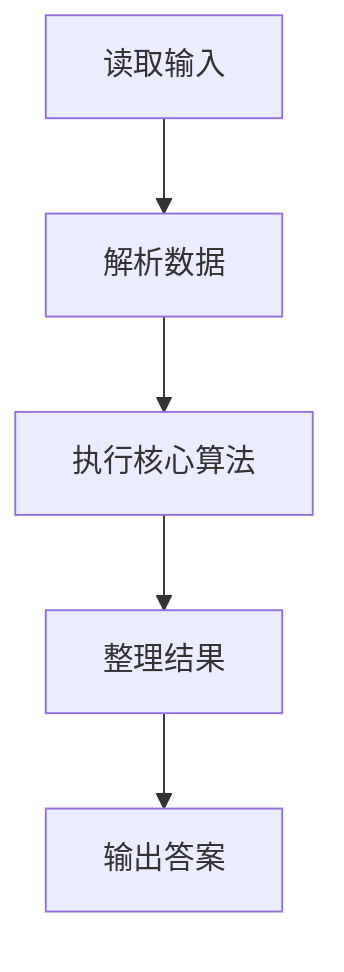
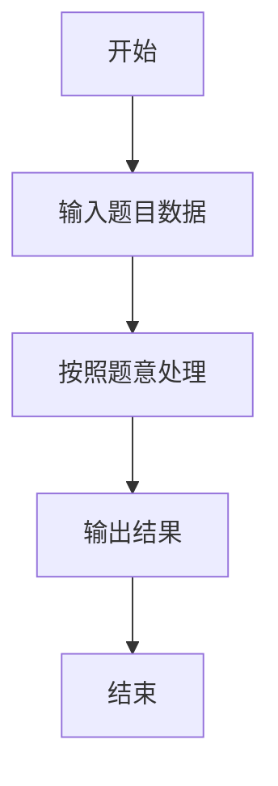

# L2-008 - 最长对称子串（25 分）

- **时间限制**: 200 ms
- **内存限制**: 65536 KB
- **代码长度限制**: 16 KB

---

## 题目描述


对给定的字符串，本题要求你输出最长对称子串的长度。例如，给定`Is PAT&TAP symmetric?`，最长对称子串为`s PAT&TAP s`，于是你应该输出11。

### 输入格式:

输入在一行中给出长度不超过1000的非空字符串。

### 输出格式:

在一行中输出最长对称子串的长度。

### 输入样例:
```in
Is PAT&TAP symmetric?
```

### 输出样例:
```out
11
```

## 示例

### 示例 1

**输入:**
```
Is PAT&TAP symmetric?
```

**输出:**
```
11
```

### 解题思路

本题的 Ruby 实现采用字符串解析与规则处理。程序先读取题目输入，建立与题意对应的数据结构，按照约束完成核心计算，并按规定格式输出结果。具体实现以同目录的 main.rb 为准。

### 代码流程说明

1. 读取并解析标准输入，转换为题目所需的数据结构。
2. 按题意执行核心算法，维护中间状态并处理边界情况。
3. 整理计算结果，按照输出格式生成答案。

### 代码实现

完整实现位于同目录的 [main.rb](./L2-008_最长对称子串/main.rb)，以下代码与该入口文件保持一致。

```ruby
# frozen_string_literal: true
require_relative '../gplt_runtime'
def entry
  s = py_readline
  best = 0
  for i in py_range(py_len(s))
    for l, r in [[i, i], [i, (i + 1)]]
      while (((l >= 0)) && ((r < py_len(s))) && ((s[l] == s[r])))
        best = py_max(best, ((r - l) + 1))
        l -= 1
        r += 1
      end
    end
  end
  py_print(best, sep: " ", ending: "\n")
end
entry
```

### 代码流程图



### 解题流程图


